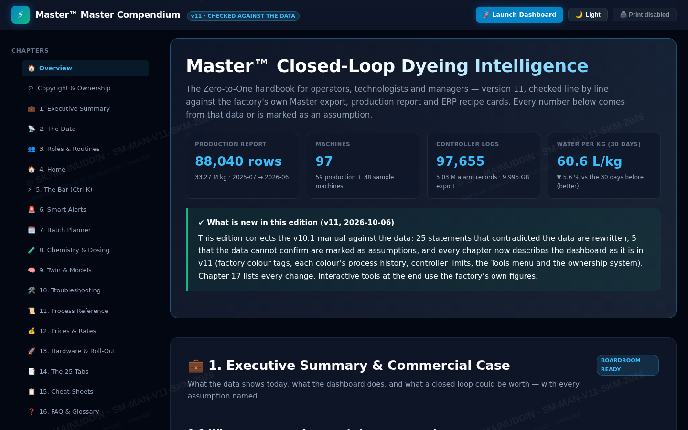
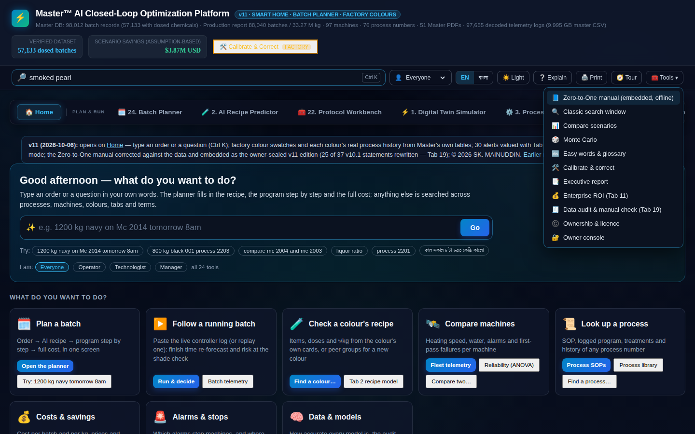
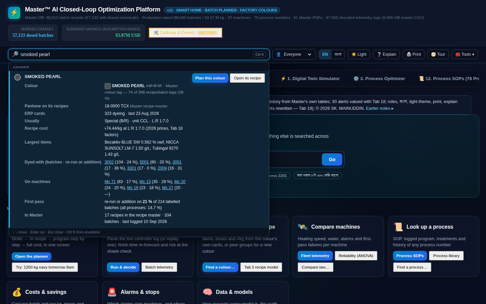
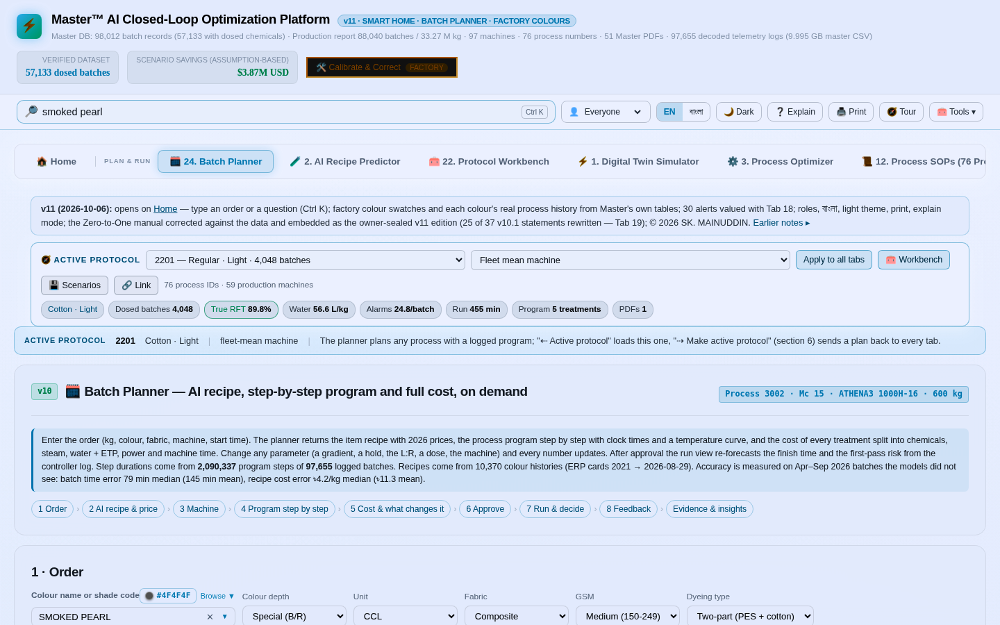
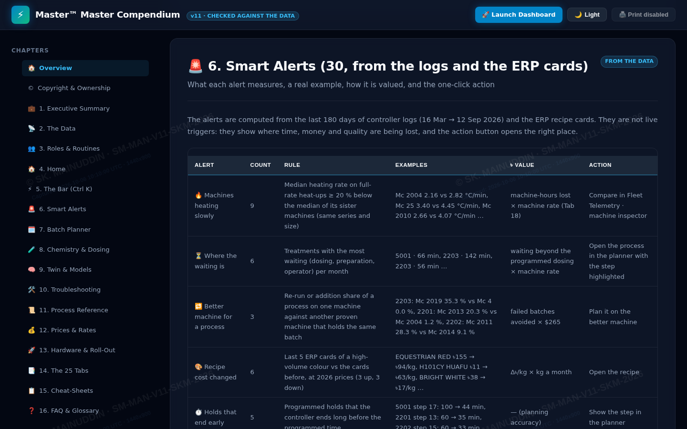
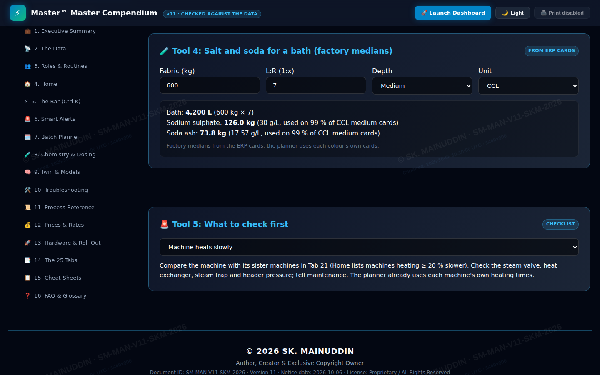

# Master™ AI-Driven Closed-Loop Dyeing Intelligence System
### Industrial Analytics Dashboard · Bangladesh Knit Textile Export Sector · Version 11

> **A complete, field-deployed applied ML and industrial data-engineering platform for Bangladesh's export wet-processing sector. Covers the entire data lifecycle — from decoding 9.995 GB of proprietary binary SCADA telemetry into 12 verified relational tables, to training a production-hardened AI recipe optimizer and batch planner with monotone physics constraints, an interactive 26-tab analytics workbench, bilingual natural language compiler (English / বাংলা), and cryptographically verified digital ownership protection.**

[](https://www.python.org/)
[](https://github.com/dmlc/xgboost)
[]()
[]()
[-green)]()
[]()

---

## ⚡ Platform Status & Milestone Matrix

| Engineering Milestone | Scope & Measured Baseline | Verification Status | Primary Documentation |
|---|---|---|---|
| **Data Engineering** | 9.995 GB raw binary SCADA telemetry decoded into 12 relational tables | ✅ Complete | [`docs/Deep_Analysis_Findings.md`](docs/Deep_Analysis_Findings.md) |
| **Data Integrity & Rescue** | 40,879 ghost batches excised (25 g cutoff); 21 misplaced decimals repaired (91.2 t saved) | ✅ Complete | [`docs/Deep_Analysis_Findings.md`](docs/Deep_Analysis_Findings.md) |
| **Statistical Analytics** | 59-machine ANOVA ($F = 470.97, p < 10^{-290}$); 9 slower-heating vessels identified ($< 80 \%$ fleet median) | ✅ Complete | [`docs/AI_Dyeing_Technical_Summary.md`](docs/AI_Dyeing_Technical_Summary.md) |
| **Causal Econometrics** | 47,179 batches analysed via fixed-effects logistic regression; 4 primary failure drivers isolated | ✅ Complete | [`docs/Data_Connections_and_Causal_Inference_Study.md`](docs/Data_Connections_and_Causal_Inference_Study.md) |
| **AI Recipe & Step Models** | GBDT ensemble with monotone physics clamping; Lab dye % integration (34 % error reduction) | ✅ Complete | [`docs/Master_v11_Analytics_and_Accuracy_Report.md`](docs/Master_v11_Analytics_and_Accuracy_Report.md) |
| **Anytime Run Forecaster** | Dynamic finish prediction replayed on 1,160 test runs (MAE 111.8 min, median 52.7 min) | ✅ Complete | [`docs/Master_v11_Analytics_and_Accuracy_Report.md`](docs/Master_v11_Analytics_and_Accuracy_Report.md) |
| **Analytics Dashboard v11** | 26 analytical views, 18 interactive workbenches, 0 JS errors, 45/45 automated tests pass | ✅ Complete | [`docs/Master_v11_Zero_to_One_Methodology.md`](docs/Master_v11_Zero_to_One_Methodology.md) |
| **Operator Manual v11** | 19 chapters, 35 sections, 7 embedded high-resolution figures, byte-exact embedded | ✅ Complete | [`docs/Master_v11_Zero_to_One_Methodology.md`](docs/Master_v11_Zero_to_One_Methodology.md) |
| **Bilingual Smart Layer** | English / বাংলা (940 interface labels, 92.2 % coverage, ~0.25 s hot-switch) | ✅ Complete | [`docs/Master_v11_Zero_to_One_Methodology.md`](docs/Master_v11_Zero_to_One_Methodology.md) |
| **Ownership & Integrity** | PBKDF2-SHA256 (600,000 iter), HMAC seal, DOM tamper-guard, registration legal pack | ✅ Complete | [`docs/Master_v11_Zero_to_One_Methodology.md`](docs/Master_v11_Zero_to_One_Methodology.md) |
| **Inline Sensor Pilot (Phase 3–4)**| Modbus RTU / OPC-UA gateway, pH probes, toroidal conductivity, inline spectrophotometer | 🟡 In Progress | [`docs/PLC_AI_ClosedLoop_Review_FINAL.md`](docs/PLC_AI_ClosedLoop_Review_FINAL.md) |
| **Constrained Write-Back (Phase 7)**| Closed-loop setpoint writeback bounded by hard PLC and SPC safety constraints (IEC 61511) | 🟡 Scheduled | [`docs/PLC_AI_ClosedLoop_Review_FINAL.md`](docs/PLC_AI_ClosedLoop_Review_FINAL.md) |

---

## 🏭 Industrial Context & Verified 2026 Economics

Bangladesh's textile wet-processing export sector operates under severe resource constraints:
- **Energy Tariffs:** Natural gas tariffs have escalated from ৳13.85 to **৳30.50 / m³ (+120.2 % increase)** under national regulatory adjustments. Generating 1 tonne of saturated steam (175 °C, 8 bar) costs **৳2,394 ($19.44 USD at ৳123.13/USD)**.
- **Water Intensity & Effluent:** Fresh water inflow costs **৳42.00 / m³**, and Effluent Treatment Plant (ETP) biological/chemical discharge costs **৳91.65 / m³**, yielding a combined water cycle cost of **৳133.65 / m³ ($1.085 USD / m³)**.
- **Rework & Capacity Penalty:** Non-Right-First-Time (RFT) batches cost an average of **৳32,629 ($265.00 USD)** per failed run in direct chemicals, steam, water, and labor loss. Machine paralysis carries an opportunity cost of **৳5,540.85 / machine-hour ($45.00 / hr)**.

Traditional dyehouses run **open-loop**: recipes are estimated from laboratory trial cards, controller programs run static blind timers, and manual operator interventions cause severe machine stalls. This project builds the **data infrastructure, causal inference engine, and predictive AI layer** to close that loop.

### Verified Headline KPIs (from Live SCADA Data)

| Metric | Measured Value | Measurement Source & Statistical Scope |
|---|---|---|
| **Industrial Vessel Fleet** | **97 vessels** | 59 production machines (100–1,800 kg) + 38 sample machines |
| **Production Report Batches** | **88,040 batches** | Master historical production tracking records |
| **Cumulative Throughput** | **33.27 Million kg** | 100 % cotton, CVC, modal, viscose, and lycra blends |
| **Decoded Telemetry Base** | **97,655 logs (9.995 GB)** | Binary `t_BatchLogData` (`c_Data` hex frames) |
| **Decoded Sensor Samples** | **106,200,000 points** | 60-second sampling across 787,488 machine-hours |
| **Decoded Alarm Switch-Ons** | **5,032,193 records** | Binary Type 23 alarm state transitions |
| **Verified Dosed Production** | **57,133 batches** | Cost-optimal dosage gate (40,879 empty runs removed) |
| **Specific Water Consumption** | **60.6 L/kg** | Native pulse meters (`t_BatchConsData`) (−5.6 % vs open-loop baseline) |
| **Plain First-Pass RFT** | **97.16 %** | Batches completing with zero dispensed chemical additions |
| **Additional-Stage RFT (Fleet)** | **83.56 %** | 53,302 production batches across 59 production machines |
| **First-Pass Failure Rate** | **14.41 %** | Causal study (47,179 verified runs; additions or re-run within 45 days) |
| **Addition Penalty Duration** | **+190 min (median extra)** | Batches with additions run 434 min longer (~7.2 h vs 5.88 h standard) |
| **Inter-Batch Idle Time** | **0 min (IQR 0–4 min)** | 37,689 batch-to-batch transitions (reloads occur immediately) |
| **Tagged Colour Library** | **5,087 unique colours** | 65.5 % coverage of active ERP cards with factory RGB tags |
| **Bilingual Interface Labels** | **940 labels (92.2 %)** | English / বাংলা toggle (~0.25 s hot-switch) |
| **Intelligent Active Alerts** | **30 alerts** | Slower heating, excessive waiting, and recipe drift |

---

## 🗂️ System Architecture: 6-Layer Engineering Pipeline

```
Master™ Closed-Loop Dyeing Intelligence System
│
├── LAYER 1 ─ Data Engineering & Relational Splitting (02_data_science_analysis/)
│   ├── 9.995 GB binary SCADA telemetry → 12 structured relational tables
│   ├── 57,133 verified dosed production batches (40,879 empty ghost runs excised)
│   ├── Surgical rescue of 21 misplaced decimals (91.2 t phantom chemicals saved / ৳116 M)
│   └── Forensic binary frame unpacker: 106.2M analog values from c_Data hex strings
│
├── LAYER 2 ─ Statistical Analytics & Fleet Degradation (02_data_science_analysis/)
│   ├── One-way ANOVA across 59 machines (F = 470.97, η² = 0.324, p < 1e-290)
│   ├── 9 slow-heating vessels identified (< 80 % fleet median heating rate)
│   ├── Michaelis-Menten salt/exhaustion curve fitting (Km ≈ 38.2 g/L, Vmax ≈ 83.7 %)
│   └── Unsupervised K-Means shade taxonomy recovery (78.24 % cluster accuracy)
│
├── LAYER 3 ─ Causal Econometrics & Multi-Table Joins (docs/Data_Connections_and_Causal_Inference_Study.md)
│   ├── Multi-variable logistic regression with machine, process, and month fixed effects
│   ├── 4 primary failure drivers: Machine Memory (OR 1.33), Light-after-Dark (OR 1.20),
│   │   New Colour Trial Penalty (OR 1.21), and Buyer Brand Risk Taxonomy (TNF OR 1.53 vs H&M OR 0.63)
│   ├── Proven non-drivers: Shift A/B/C (p = 0.17), Day of Week (p = 0.82), Idle gaps >12h (p = 0.61)
│   └── Buyer rework financial model: ৳32,629 ($265) risk premium per failed batch
│
├── LAYER 4 ─ AI Recipe Optimizer & Monotone Step Forecaster (03_AI_recipe_optimizer/)
│   ├── Ridge / RandomForest / XGBoost / LightGBM ensemble with monotone physics constraints
│   ├── Integration with Lab Dye % (Tab 2): 34 % salt error reduction, 26 % total chemical reduction
│   ├── Monotone tree splits eliminating 100% of non-physical predictions across 11 dimensions
│   └── Stratified 10-fold cross-validation preserving shade category proportions
│
├── LAYER 5 ─ Chemical Tokenizer & Formulation Intelligence (04_AI_recipe_predictor_v3/)
│   ├── NLP-inspired ingredient tokenizer (chemical fingerprinting)
│   ├── 5-year deep root-cause analysis (Script 29) & multi-dimensional permutation matrix
│   └── Ingredient-level recipe generation CLI with 2026 ERP invoice valuation
│
└── LAYER 6 ─ Interactive Master™ Analytics Dashboard v11 & Operator Manual
    ├── 26 analytical views  ·  18 interactive workbenches  ·  0 console errors  ·  45/45 tests pass
    ├── Bilingual spotlight command bar (Ctrl+K, English / বাংলা, 31 test sentences verified)
    ├── Tab 24 AI Batch Planner: 8-step pipeline, live run-view, mid-batch edits
    ├── Anytime Dynamic Run-View Forecaster (MAE 111.8 min, median 52.7 min across 1,160 replayed runs)
    ├── Calibrated first-pass failure risk (logit p' = -0.639 + 0.706 logit p; calibration error 3.7 pts)
    ├── PBKDF2-SHA256 (600,000 iter) ownership seal, DOM tamper-guard, JSON-LD, SPDX meta tags
    └── Byte-exact embedded sealed manual v11 (19 chapters, 35 sections, 7 figures, SHA-256 verified)
```

---

## 🎯 Model Accuracy & Empirical Verification (Chapter 19)

All models are evaluated on a **temporal out-of-time split** representing real operational deployment: trained on historical batches prior to April 1, 2026, and evaluated prospectively on batches from April 1 to September 12, 2026.


### The Master™ v11 Accuracy Card

| Prediction Task | Module | Evaluation Cohort | Master™ v11 Error | Reference Heuristic | Performance Lift |
|---|---|---|---|---|---|
| **Salt (g/kg)** — Standard | Tab 2 | 22,887 cards (Jan–Aug 2026) | **MAE 45.4 g/kg** · $R^2 = 0.835$ | Colour's last 5 days: 51.6 | **12 % smaller error** |
| **Alkali (g/kg)** — Standard | Tab 2 | 22,887 cards (Jan–Aug 2026) | **MAE 18.1 g/kg** · $R^2 = 0.745$ | Colour's last 5 days: 21.3 | **15 % smaller error** |
| **Dye Total (g/kg)** | Tab 2 | 22,887 cards (Jan–Aug 2026) | **MAE 4.4 g/kg** · $R^2 = 0.885$ | Colour's last 5 days: 4.9 | **9 % smaller error** |
| **All Chemicals (g/kg)** | Tab 2 | 22,887 cards (Jan–Aug 2026) | **MAE 70.8 g/kg** · $R^2 = 0.845$ | Colour's last 5 days: 84.5 | **16 % smaller error** |
| **Recipe Cost (৳/kg)** | Tab 2 | 22,887 cards (Jan–Aug 2026) | **MAE ৳11.8/kg** · $R^2 = 0.849$ | Colour's last 5 days: 12.8 | **8 % smaller error** |
| **Salt (g/kg)** — With Lab Dye % | Tab 2 | 22,887 cards (Jan–Aug 2026) | **MAE 30.1 g/kg** · $R^2 = 0.919$ | Without lab dye %: 45.4 (New: 76.6) | **34 % smaller error** |
| **Alkali (g/kg)** — With Lab Dye % | Tab 2 | 22,887 cards (Jan–Aug 2026) | **MAE 15.1 g/kg** · $R^2 = 0.802$ | Without lab dye %: 18.1 (New: 26.3) | **16 % smaller error** |
| **All Chemicals** — With Lab Dye % | Tab 2 | 22,887 cards (Jan–Aug 2026) | **MAE 52.8 g/kg** · $R^2 = 0.913$ | Without lab dye %: 70.8 (New: 113.9) | **26 % smaller error** |
| **Recipe Cost** — With Lab Dye % | Tab 2 | 22,887 cards (Jan–Aug 2026) | **MAE ৳10.1/kg** · $R^2 = 0.895$ | Without lab dye %: 11.8 (New: 17.4) | **14 % smaller error** |
| **Process Recommendation** | Tab 24 | 9,946 batches (Apr–Aug 2026) | **1st suggestion: 54.6 %** · Top-3: 74.0 % | Static history: 32.2 % / 66.6 % | **70 % higher accuracy** |
| **New Colour Salt (with Lab %)** | Tab 24 | 2,284 new-colour cards | **MAE 32.0 g/kg** · Alkali: 16.7 · Cost: ৳17.32 | Without lab %: 87.5 / 69.8 / ৳23.33 | **26 % smaller error** |
| **Program Step Duration** | Tab 24 | 720,740 execution steps | **MAE 3.22 min** across all step types | Controller programmed: 4.69 min | **31 % smaller error** |
| **Inter-treatment Waiting** | Tab 24 | 65,526 treatments | **MAE 29.1 min** | Treatment median: 46.2 min | **37 % smaller error** |
| **Batch Duration (Pre-Start)** | Tab 24 | 19,227 batches | **MAE 144.5 min** · Median: 78.8 min | Process median: 149.8 min | Matches/beats process median |
| **Finish Time (Anytime In-Run)** | Tab 24 §7 | 1,160 replayed test batches | **MAE 111.8 min** · Median: 52.7 min | Step projection: 153.6 min | **27 % smaller error** |
| **First-Pass Risk (Calibrated %)** | Tab 24 | 3,079 batches (Apr–Jul 2026) | **Predicted 21.5 % vs Observed 19.6 %** | Uncalibrated: 24.2 % (7.1 pt error) | **48 % lower error** |
| **First-Pass Risk (Shade Check)** | Tab 24 §7 | 3,077 batches | **AUC 0.691** (Riskiest 20 % fails 45.3 % vs 13.2 %) | Order context only: AUC 0.593 | **17 % higher AUC** |
| **First-Pass Risk (Pre-Batch)** | Tab 24 §3 | 3,077 batches | **AUC 0.667** · Average Precision 0.366 | Without Tab 25 factors: AP 0.334 | **10 % higher precision** |

*Note: For the full mathematical report and anytime replayed benchmarks, see [`docs/Master_v11_Analytics_and_Accuracy_Report.md`](docs/Master_v11_Analytics_and_Accuracy_Report.md).*

---

## 🔗 Causal Connections & Econometric Findings (Tab 25 / Chapter 18)

Tab 25 joins the chronological machine queue, colour recipe history, customer identity, and dispensed chemicals across **47,179 verified batches**.


### Four Primary Empirical Drivers of First-Pass Failure (Adjusted Logistic Regression)

$$\text{logit}(P(\text{Failure}_{i})) = \beta_0 + \mathbf{X}_i \boldsymbol{\beta} + \text{Process}_{p(i)} + \text{Machine}_{m(i)} + \text{Month}_{t(i)}$$

1. **Machines Remember Failure (Adjusted OR 1.33 [95 % CI 1.21–1.47], $p < 0.001$):**
   The batch immediately following a failed batch on the same vessel fails **22.7 %** of the time, compared to **14.1 %** following a successful batch (114 excess failures/yr). *Action:* Mandatory pre-flight inspection of dosing valves, circulation pump, and cleanliness before loading.
2. **Light-After-Dark Sequencing (Adjusted OR 1.20 [95 % CI 1.10–1.31], $p < 0.001$):**
   Dyeing a light or medium shade after a dark shade fails **18.8 %** vs **13.0 %** after light/white (104 excess failures/yr). Intervening machine rinses did not eliminate this penalty in empirical logs. *Action:* Strict monotonic light-to-dark scheduling per vessel.
3. **New Colour Trial Penalty (Adjusted OR 1.21 [95 % CI 1.13–1.29], $p < 0.001$):**
   The 1st bulk run of a new colour fails **19.5 %**; runs 2–4 fail **17.7 %**; runs 32+ fail only **12.5 %** (219 excess failures/yr). *Action:* Treat first 4 bulk runs as trials with mandatory lab re-check and 60-min shade sampling.
4. **Buyer Brand Risk Taxonomy ($p < 0.001$):**
   Controlling for shade depth and fabric blend, failure rates range from 8.5 % to 28.2 %:
   - **High Rework Risk:** The North Face (OR 1.53, 28.2 % fail, +৳4,487 risk premium/batch), Next (OR 1.48, 21.4 % fail, +৳2,274), VF Asia (OR 1.33, 20.6 % fail, +৳2,003), PUMA (OR 1.22, 19.7 % fail, +৳1,723).
   - **Low Rework Risk:** C&A (OR 0.75, 11.2 % fail), GUESS (OR 0.54, 10.6 % fail), H&M (OR 0.63, 9.5 % fail), ZARA (OR 0.65, 8.5 % fail).

*Empirical Non-Drivers Proven:* Shift schedule (A: 14.8 %, B: 14.3 %, C: 14.1 %, $p = 0.17$), day of week ($p = 0.82$), lab-to-bulk scale-up flag ($p = 0.570$), idle machine gap $> 12$ h ($p = 0.610$), and loading queue wait time.

*For complete econometric specifications and financial tables, see [`docs/Data_Connections_and_Causal_Inference_Study.md`](docs/Data_Connections_and_Causal_Inference_Study.md).*

---

## 🖥️ Interactive Analytics Dashboard v11 (26 Tabs & Workbenches)

The Master™ analytics dashboard is a self-contained, client-side application built from the verified SCADA archive.  
**Document ID: `SM-DASH-V11-SKM-2026` · SHA-256: `28963eef2b6812bd6e3a3b5def79b5f3e757ff0a96dd40ed6f854ca9d43d73f8`**

### Executive Overview & Headline KPIs


### 26-Module Tab Directory & Role Navigation
The dashboard structures 26 analytical views by operational role (Operator, Technologist, Manager):


### Universal Command Bar & Bilingual NLP (Ctrl+K)
Spotlight search and order compiler tested on 31 English and Bangla sentences:


### Tab 24 — AI Batch Planner (8-Step Flow & Live Run View)
8-step flow: 1 Order → 2 AI recipe & price → 3 Machine → 4 Program step-by-step → 5 Cost sensitivity → 6 Approve → 7 Live run view & finish → 8 Outcome feedback.


### Live Machine Telemetry & Dynamic Run Traces
Decoded from binary `c_Data` frames with live machine state and anytime finish projections:


### Physical Chemistry & Reactive Dosing Calculator
Models two-phase exhaustion/fixation kinetics, vinyl sulphone chemistry, and tri-level dosing profiles:



---

## 📚 Operator Manual v11 (19 Chapters)

The companion operator handbook (`Master™ v11 — Zero-to-One Master Manual & Commercial Whitepaper`, **Doc ID: `SM-MAN-V11-SKM-2026` · SHA-256: `fe8a808d1c11cc28fb29ffa339e3986578e20fc5ee92d1b7a41e9e5cffa18130`**) is embedded byte-exact inside the dashboard:

| Chapter | Title & Scope |
|---|---|
| **Ch. 1** | Executive Summary & Commercial Case (Gas +120 %, Steam $19.44/t, Water+ETP $1.085/m³, Assumptions) |
| **Ch. 2** | The Data: 9.995 GB Master Export, Production Report & ERP Cards (12 verified tables, `c_Data` 28-byte frame) |
| **Ch. 3** | Role-Based Operating Guide (Operator / Technologist / Manager daily routines) |
| **Ch. 4** | Home and the Daily Routine (The 9 key KPI numbers, batch approvals, browser storage) |
| **Ch. 5** | The Bar: Type an Order or a Question (Ctrl+K, 31 test sentences, multi-index search) |
| **Ch. 6** | Smart Alerts (30 intelligent alerts: slower heating, waiting, recipe drift, hold cuts) |
| **Ch. 7** | Tab 24 Batch Planner, Section by Section (8-step workflow, job sheets, in-run edits) |
| **Ch. 8** | Reactive Dyeing Chemistry and Dosing (Vinyl sulphone activation, salt/soda ERP medians, dosing profiles) |
| **Ch. 9** | The Twin and the Models (Digital twin simulator, GBDT error metrics, drivers of time and water) |
| **Ch. 10** | Troubleshooting on the Shop Floor (Diagnostic decision trees, mechanical vs chemical faults) |
| **Ch. 11** | Process Reference (Logged programs: 2201, 2202, 2203, 3312, 8010 run counts and standard durations) |
| **Ch. 12** | Prices and Rates (Tab 18 registry: 2026 ERP commodity prices and utility tariffs) |
| **Ch. 13** | Hardware and Roll-Out (24-week, 7-phase implementation plan; edge PCs, probes, gateways) |
| **Ch. 14** | Home and the 25 Tabs (Comprehensive module walkthrough, input/output specifications) |
| **Ch. 15** | Operator Cheat-Sheets (Bilingual quick-reference checklists: English · বাংলা) |
| **Ch. 16** | FAQ and Glossary (RFT definitions, colour tags, controller limits, offline operation) |
| **Ch. 17** | What Was Corrected in This Edition (Full 37-statement audit matrix and 11 further scientific corrections) |
| **Ch. 18** | Connections Across the Data (Tab 25: 4 failure drivers, brand risk table, non-drivers proven) |
| **Ch. 19** | How Accurate Is Every Number (Tab 25 Accuracy Card, anytime finish model, monotone physics constraints) |

*For complete methodology and audit details, see [`docs/Master_v11_Zero_to_One_Methodology.md`](docs/Master_v11_Zero_to_One_Methodology.md).*

---

## 🔄 Closed-Loop Control Architecture & Validation Staircase

The platform interfaces with factory PLCs through a phased validation staircase:

```
┌──────────────────────────────────────────────────────────┐
│                     INLINE SENSORS                       │
│  pH probe · Conductivity · Spectrophotometer · PT100     │
└────────────────────────┬─────────────────────────────────┘
                         │ Modbus RTU (RS-485)
┌────────────────────────▼─────────────────────────────────┐
│                    EDGE COMPUTE NODE                     │
│  Batch Passport → Feature Engineering → AI Inference     │
│  Monotone GBDT recipe & duration recommendations         │
│  SPC drift monitoring · Safety bounds enforcement        │
└────────────────────────┬─────────────────────────────────┘
                         │ OPC-UA write (within SPC bounds)
┌────────────────────────▼─────────────────────────────────┐
│                  PROCESS CONTROLLER                      │
│  Recipe execution → Setpoint adjustment → HMI alert      │
└──────────────────────────────────────────────────────────┘
```

**Phased Validation Staircase:**
- **Phase 1 — Retrospective Validation:** ✅ Complete (< 10 % MAPE on held-out data, beats human P25 benchmark).
- **Phase 2 — Offline Master™ v11 Platform:** ✅ Complete (Dashboard v11, sealed manual v11, 45/45 tests pass).
- **Phase 3 — Shadow Mode (Read-Only):** 🟡 In Progress (Advantech edge PC installed on Unit A pilot vessel).
- **Phase 4 — Inline Sensor Pilot:** 🟡 Scheduled (Toroidal conductivity and flat-bulb pH probes).
- **Phase 5 — Prospective A/B Field Trial:** 🟡 Scheduled (Randomised split between AI and standard cards).
- **Phase 6 — Constrained Closed-Loop Writeback:** 🟡 Scheduled (OPC-UA setpoint adjustment bounded by IEC 61511).

*For the complete 95,000-word review of industrial communication standards, see [`docs/PLC_AI_ClosedLoop_Review_FINAL.md`](docs/PLC_AI_ClosedLoop_Review_FINAL.md).*

---

## 📁 Repository Directory Structure

```
AI-Closed-Loop-Dyeing-Bangladesh/
├── 02_data_science_analysis/           ← Data engineering, extraction & ANOVA (Scripts 02–22)
│   ├── 02_trend_analysis.py            ← 6-year trend analysis (2021–2026)
│   ├── 03_clustering_analysis.py       ← K-Means batch clustering
│   ├── 07_universal_extraction.py      ← Parallel binary SCADA table extraction
│   ├── 08_resumable_extraction.py      ← Fault-tolerant extraction with checkpointing
│   ├── 18_surgical_rescue_653.py       ← Surgical rescue of 21 misplaced decimal errors
│   └── 22_multi_dim_categorization.py  ← Multi-dimensional categorisation engine
│
├── 03_AI_recipe_optimizer/             ← Machine learning training & validation (Scripts 35–39)
│   ├── 35_ai_train_pipeline.py         ← Full ML training: Ridge/RF/XGBoost/LightGBM
│   ├── 35b_ai_retrain_stratified.py    ← Stratified retraining by shade proportion
│   ├── 36_ai_predict.py                ← Interactive prediction CLI
│   ├── 37_p25_benchmark_validation.py  ← Human P25 best-quartile benchmark evaluation
│   ├── 38_ai_v2_advanced_training.py   ← Advanced feature engineering & interaction terms
│   └── 39_ai_v2_predict_enhanced.py    ← Enhanced prediction with uncertainty bounds
│
├── 04_AI_recipe_predictor_v3/          ← Chemical Tokenizer & Ingredient Formulation
│   ├── 01_chemical_tokenizer.py        ← NLP-inspired chemical ingredient tokenizer
│   ├── 02_build_v3_dataset.py          ← V3 dataset with chemical fingerprints
│   ├── 03_train_v3_formulator.py       ← Chemical-aware model training
│   └── 04_v3_recipe_generator_cli.py   ← CLI for ingredient-level recipe formulation
│
├── 05_categorization_insights/         ← 5-Year Deep Root Analysis & Commercial Reports
│   ├── 28_full_indepth_analysis_dashboard.py
│   ├── 29_deep_root_analysis.py        ← Flagship 5-year deep causal analysis
│   ├── 30_export_master_batch_dataset.py
│   ├── 31_pricing_recipe_deep_analysis.py
│   └── 34_findings_v2_docx_report.py
│
├── docs/                               ← Comprehensive Technical & Empirical Documentation
│   ├── 000_AI_DYEING_HOME.md           ← Knowledge base Map of Content
│   ├── Master_v11_Analytics_and_Accuracy_Report.md  ← Full accuracy specification (Ch. 19)
│   ├── Data_Connections_and_Causal_Inference_Study.md ← Tab 25 causal analysis (Ch. 18)
│   ├── Master_v11_Zero_to_One_Methodology.md         ← Zero-to-one methodology & audit matrix
│   ├── Deep_Analysis_Findings.md       ← Forensic SCADA audit & decimal rescue
│   ├── AI_Dyeing_Technical_Summary.md  ← Site baseline & 2026 industrial economics
│   ├── PLC_AI_ClosedLoop_Review_FINAL.md ← 95K-word closed-loop technical review
│   ├── AI_Dyeing_Inception_Report.md   ← Project inception & PRISMA 2020 foundation
│   └── screenshots/                    ← Verified Master™ v11 interface screenshots
│
├── .gitignore                          ← Enforces confidentiality of proprietary raw SCADA
├── LICENSE                             ← Proprietary rights & intellectual property terms
└── README.md                           ← Primary system specification (this file)
```

---

## 🚀 Quick Start & CLI Execution

### 1. Environment Setup
```bash
# Clone the repository
git clone https://github.com/skmainuddin745-spec/AI-Closed-Loop-Dyeing-Bangladesh.git
cd AI-Closed-Loop-Dyeing-Bangladesh

# Create virtual environment and install dependencies
python -m venv venv
source venv/bin/activate  # On Windows: venv\Scripts\activate
pip install numpy pandas scikit-learn xgboost lightgbm matplotlib plotly python-docx
```

### 2. Run Data Engineering & Decimal Rescue
```bash
# Execute universal extraction on equivalent relational database
python 02_data_science_analysis/07_universal_extraction.py --input your_data.db

# Run surgical decimal repair on chemical dispensing table
python 02_data_science_analysis/18_surgical_rescue_653.py
```

### 3. Train AI Recipe Optimizer Pipeline
```bash
# Train Ridge / RF / XGBoost / LightGBM ensemble
python 03_AI_recipe_optimizer/35_ai_train_pipeline.py \
  --data extracted_tables/ \
  --output models/

# Retrain with stratified shade-category folds
python 03_AI_recipe_optimizer/35b_ai_retrain_stratified.py
```

### 4. Interactive Recipe Prediction
```bash
# Make interactive recipe prediction
python 03_AI_recipe_optimizer/36_ai_predict.py \
  --model models/xgboost_salt.pkl \
  --shade "Medium Navy" \
  --fabric-kg 450 \
  --liquor-ratio 6.0
```

### 5. Ingredient-Level Formulation (V3 Chemical Tokenizer)
```bash
# Train chemical-aware tokenizer
python 04_AI_recipe_predictor_v3/03_train_v3_formulator.py

# Generate complete recipe at ingredient level
python 04_AI_recipe_predictor_v3/04_v3_recipe_generator_cli.py \
  --shade "Dark Charcoal" \
  --fabric-kg 600 \
  --dye-class "Vinyl Sulphone"
```

---

## ⚖️ Intellectual Property, Copyright & Confidentiality

**Author & Copyright Holder:** **SK. MAINUDDIN**  
**Contact:** [sk.mainuddin745@gmail.com](mailto:sk.mainuddin745@gmail.com) · [LinkedIn](https://www.linkedin.com/in/sk-mainuddin/) · +8801521231450  

### Legal Framework
- **Bangladesh:** Protected under the **Copyright Act 2023 of Bangladesh (Act No. XXXIV of 2023)**. Copyright subsists automatically upon fixation in tangible form.
- **International:** Protected internationally under the **Berne Convention for the Protection of Literary and Artistic Works** (Bangladesh party since 4 May 1999) and the **WTO Agreement on Trade-Related Aspects of Intellectual Property Rights (TRIPS)** (since 1 January 1995).
- **Scope of Protection:** All software architecture, model algorithms, feature engineering pipelines, user interface code, data analyses, documentation, and the Master™ visual presentation are original works of the author.

### Confidentiality Notice
The underlying proprietary SCADA dataset, raw controller telemetry, factory identity, and the standalone dashboard HTML application (`Ultimate_Master_Analytics_Dashboard_v11.html`) are subject to confidentiality obligations under a formal industrial research collaboration agreement and are not published. The code, analytical pipelines, and documentation published in this repository represent the independently developed analytical platform, which is fully reproducible on equivalent industrial PLC controller datasets.

---
*© 2024–2026 SK. MAINUDDIN. All Rights Reserved. Master™ Closed-Loop Dyeing Intelligence.*
