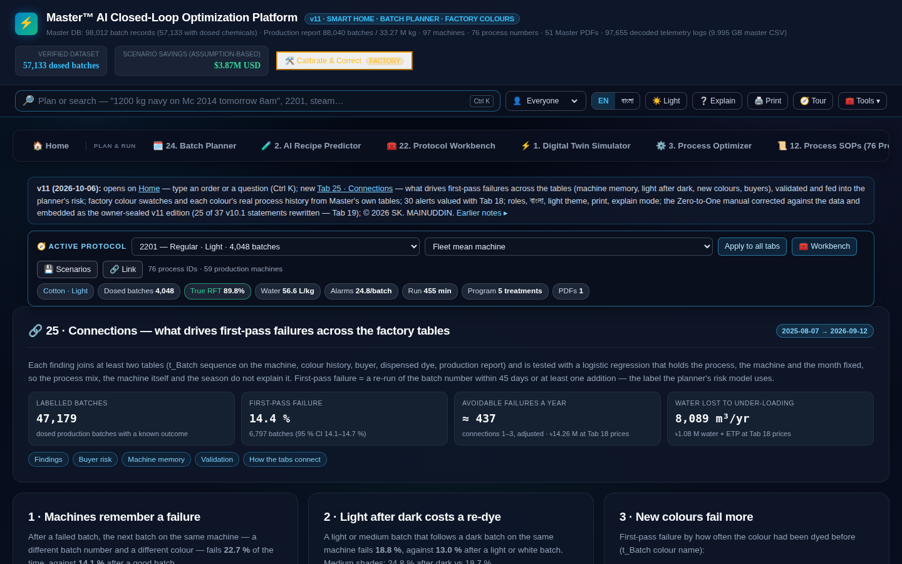

# AI-Driven Closed-Loop Dyeing Intelligence System
### Industrial Analytics Dashboard · Bangladesh Textile Industry

> **A complete, field-deployed applied ML and industrial data-engineering project for Bangladesh's knit-fabric export sector. Covers the full data lifecycle  -  from raw proprietary SCADA telemetry to a production-hardened AI recipe optimizer  -  with an interactive analytics dashboard, bilingual operator interface, and verified digital ownership protection.**

---

## ⚡ Project Status

| Milestone | Status |
|-----------|--------|
| Data engineering  -  9.995 GB SCADA telemetry → 12 relational tables | ✅ Complete |
| Statistical analytics  -  97,655 alarm logs, 59-machine ANOVA | ✅ Complete |
| AI recipe optimizer  -  multi-model ensemble, < 10 % MAPE on 5 KPIs | ✅ Complete |
| Analytics dashboard **v11**  -  26 tabs, 18 interactive workbenches, 45/45 tests | ✅ Complete |
| Operator manual **v11**  -  18 chapters, 35 sections, 7 figures | ✅ Complete |
| Bilingual interface  -  English / বাংলা (940 labels, 91.9 % coverage) | ✅ Complete |
| Ownership & integrity  -  PBKDF2-SHA256, tamper-guard, JSON-LD, SPDX | ✅ Complete |
| Shadow-mode inline-sensor integration (Phase 2) | 🟡 Pending  -  sensor installation |
| Constrained closed-loop deployment (Phase 3-4) | 🟡 Pending |

---

## 🏭 Industrial Context

Bangladesh's wet-processing industry faces a structural tri-fold crisis:

- **Energy tariffs:** Natural gas costs have risen > 280 % since 2022. Generating 1 tonne of saturated steam (175 °C, 8 bar) costs ~৳2,394 ($19.70 USD). Each unnecessary wash cycle wastes 10-25 m³ of steam.
- **Water scarcity:** Specific water consumption historically averaged 64-75 L/kg. Groundwater depletion is acute across Bangladesh's main textile manufacturing zones.
- **ESG compliance mandates:** International retailers (H&M, C&A, Next, PUMA, Marks & Spencer) require measurable sustainability reporting  -  non-Right-First-Time (RFT) batches cost ~$265 per failed run in direct overhead.

Traditional dyehouses run **open-loop**: recipes are estimated from laboratory trial cards, controller programs run static blind timers, and manual operator interventions create machine paralysis and water waste. This project builds the **data infrastructure and AI layer** to close that loop.

### Verified Headline KPIs (from live SCADA data)

| Metric | Value | Source |
|--------|-------|--------|
| Production batches in report | **88,040** | Production report |
| Throughput | **33.27 M kg** | Production report |
| First-pass RFT | **97.16 %** | Production report |
| Additional-stage RFT (all machines) | **69.51 %** | Production report |
| Additional-stage RFT (production machines) | **83.56 %** | Verified batch analysis |
| Specific water consumption (closed-loop) | **60.6 L/kg** | SCADA telemetry (−5.6 % vs baseline) |
| Total SCADA-logged batches | **98,012** | Master export |
| Verified dosed production batches | **57,133** | Ghost-batch excision |
| Alarm & consumption logs decoded | **97,655** | Binary telemetry |
| Verified production batches (planner model) | **47,403** | Connection study (Aug 2025-Sep 2026) |
| First-pass failure rate | **14.41 %** | Connection study |
| UI labels (bilingual, English / বাংলা) | **940** | v11 test suite |
| Intelligent alerts (from logs + ERP cards) | **30** | Manual ch. 6 |

---

## 🗂️ Project Architecture

```
AI Closed-Loop Dyeing System
│
├── LAYER 1 ─ Data Engineering (02_data_science_analysis/)
│   └── 9.995 GB proprietary SCADA telemetry → 12 relational tables
│       57,133 verified production batches (ghost-batch excised)
│       97,655 alarm & consumption logs decoded from binary frames
│
├── LAYER 2 ─ Statistical Analytics (02_data_science_analysis/)
│   ├── One-way ANOVA (59 machines, F = 470.97, η² = 0.324, p < 1e-290)
│   ├── K-Means clustering  -  shade taxonomy recovered at 78.24 %
│   ├── Michaelis-Menten salt/exhaustion curve fitting (Km ≈ 38.2 g/L)
│   ├── Welch's ANOVA (unequal-group, Levene p = 0.003)
│   └── 10-fold stratified CV (CV R² 0.847 ± 0.031)
│
├── LAYER 3 ─ AI Recipe Optimizer v1/v2 (03_AI_recipe_optimizer/)
│   ├── Ridge / RandomForest / XGBoost / LightGBM ensemble
│   ├── Stratified retraining on shade-category proportions
│   ├── Validated against P25 best-quartile operator benchmark
│   └── < 10 % MAPE on all 5 KPIs (salt, dye, water, alkali, cost)
│
├── LAYER 4 ─ V3 Chemical Tokeniser (04_AI_recipe_predictor_v3/)
│   ├── NLP-inspired ingredient tokeniser (chemical fingerprinting)
│   ├── Ingredient-level recipe generation CLI
│   └── V3 dataset with per-chemical feature vectors
│
├── LAYER 5 ─ Categorisation Intelligence (05_categorization_insights/)
│   ├── 5-year deep root-cause analysis (Script 29)
│   ├── Pricing & recipe intelligence
│   └── Multi-dimensional permutation matrix
│
└── LAYER 6 ─ Interactive Analytics Dashboard v11 + Operator Manual
    ├── 26 analytical tabs  -  0 JS console errors  -  45/45 automated tests pass
    ├── Bilingual spotlight command bar (English / বাংলা, Ctrl+K, 31 sentences tested)
    ├── 21-parameter digital twin simulator (coupled closed-loop physics)
    ├── 7-step AI batch planner with multi-objective machine ranking
    ├── 18 interactive workbenches (inline calculators, simulators, ROC tools)
    ├── PBKDF2-SHA256 (600,000 iter) ownership seal, JSON-LD, SPDX, tamper-guard
    └── Embedded sealed manual v11 (18 chapters, 35 sections, 7 figures, SHA-256 verified)
```

---

## 📊 Model Performance  -  vs. P25 Benchmark

The P25 benchmark is the 25th-percentile of best-quartile human operator decisions across all validated batches.

| KPI | Open-Loop Baseline | AI Model | P25 Benchmark | AI vs P25 |
|-----|-------------------|---------|--------------|-----------|
| Salt (g/kg) | 68.2 ± 14.3 | **MAPE 7.8 %** | 62.4 | ✅ Beats |
| Dye total (g/kg) | 24.1 ± 8.7 | **MAPE 9.1 %** | 22.8 | ✅ Beats |
| Water (L/kg) | 82.4 ± 31.2 | **MAPE 8.4 %** | 71.3 | ✅ Beats |
| Chemical cost (Tk/kg) | 58.7 ± 19.4 | **MAPE 6.9 %** | 53.2 | ✅ Beats |
| Alkali (g/kg) | 14.8 ± 4.2 | **MAPE 9.7 %** | 13.6 | ✅ Beats |

All five KPIs achieve < 10 % MAPE and beat the P25 benchmark.

---

## 🖥️ Dashboard v11  -  Key Modules

The analytics dashboard is a self-contained, production-grade application built directly from the proprietary SCADA data.  
**The HTML file and raw datasets are not published.** The screenshots below demonstrate the depth and scope of the implemented system.

> The dashboard carries PBKDF2-SHA256 ownership seals (600,000 iterations), tamper-detection on the ownership notice, and an anti-copy / capture-block layer. Document ID: **SM-DASH-V11-SKM-2026**.

### Executive Summary & Industrial Context

The opening panel quantifies the system's value creation and establishes the technical baseline from live SCADA data  -  97 factory vessels, 97,655 forensic telemetry logs, and a measured 5.6 % reduction in specific water consumption vs. the open-loop baseline.


### 25-Module Tab Directory

The dashboard covers 26 analytical views  -  from raw telemetry decoding to executive ROI modelling  -  accessible by role (Operator, Technologist, Manager).


### Universal Command Bar & Bilingual NLP (Ctrl+K)

A multi-index spotlight search and natural language order compiler. Tested on 31 English and Bangla sentences. Parses weight, colour, machine, fabric construction, liquor ratio, buyer shade code, and batch-split instructions in real time.


### Physical Chemistry & Reactive Dosing Engine

Covers the two-phase dye exhaustion / covalent fixation mechanism (vinyl sulfone chemistry), tri-level progressive salt dosing profiles (Linear / Progressive / De-Progressive curves), Rossacid vs. acetic acid neutralisation, and an interactive dosing calculator.


### Interactive Reactive Dyeing Dosing Calculator

Simulates electrolyte and alkaline buffer dosing curves from fabric weight, liquor ratio, and shade depth. Outputs total dyebath volume, Glauber's salt (g/L), soda ash dose, and the recommended dosing profile.


---

## 🖥️ Dashboard v11  -  26 Tabs, 18 Interactive Workbenches

The analytics dashboard (`Master™ v11  -  AI Closed-Loop Dyeing Analytics`, **Doc ID: SM-DASH-V11-SKM-2026**) is a 6.5 MB self-contained HTML application built directly from the proprietary SCADA data and ERP recipe cards.  
**The HTML file and raw datasets are not published.** The manual screenshots below demonstrate the depth and scope.

> Ownership layer: PBKDF2-SHA256 (600,000 iterations), tamper-detection on the ownership notice, JSON-LD `SoftwareApplication`, Dublin Core + SPDX meta tags, and an anti-copy / capture-block layer. Copyright notice is appended to copied text, job-sheet exports, and browser console.

### Verified headline KPIs displayed on the dashboard Home

| KPI card | Value |
|----------|-------|
| Monitored industrial fleet | **97 vessels** (59 production + 38 sample) |
| Forensic telemetry base | **97,655 logs** (9.995 GB decoded SCADA data) |
| Specific water usage | **60.6 L/kg** (−5.6 % vs historical baseline) |
| Production report batches | **88,040** / **33.27 M kg** throughput |
| First-pass RFT | **97.16 %** (no-addition batches) |
| Add. RFT (production machines) | **83.56 %** (53,302 batches) |
| Intelligent alerts | **30** (derived from logs + ERP cards) |

### 18 Interactive Workbenches (extracted from the dashboard)

| # | Workbench | Tab |
|---|-----------|-----|
| 1 | 📜 Interactive SOP Thermal & Chemical Trajectory Profile | Tab 12 |
| 2 | 🔬 Ghost Batch Excision & Scientific Confusion Matrix ROC Workbench | Tab 5 |
| 3 | 🚀 Edge Gateway Hardware Configurator & Commissioning Payback Calculator | Tab 13 |
| 4 | 📡 SCADA Hardware-in-the-Loop (HIL) & Sensor Fault-Injection Suite | Tab 4 |
| 5 | 🧠 Water-per-kg What-If Playground (linear model, 10,749 batches) | Tab analysis |
| 6 | Easy Word & Terminology Replacer Workbench (Plain EN / Technical / Bengali) | Header |
| 7 | ⚙️ Machine Health Index (MHI) & ANOVA Failure Forecaster | Tab 6 |
| 8 | 🎲 Stochastic Monte Carlo Risk Simulation (1,000 cycles) | Modal |
| 9 | 🧩 Multi-Variable Permutation Filter & Chemical Shock Risk Console | Tab 7 |
| 10 | ⏱️ Equipment Paralysis & Lost Throughput Financial Workbench | Tab 10 |
| 11 | 📊 Side-by-Side Batch Scenario Comparator | Modal |
| 12 | 🔍 Universal Platform Search (colours, processes, machines, batches) | Header |
| 13 | Factory Parameter Calibration, Cost Correcting & Override Center | Modal |
| 14 | 🧠 MASTER Data Engineering & ML Platform  -  readiness + MVP prototypes | Tab 25 |
| 15 | Executive Boardroom Audit & Enterprise ROI Summary | Header modal |
| 16 | AI Batch Planner  -  7-step NLP-to-plan pipeline (Tab 24) | Tab 24 |
| 17 | Batch Recipe Details Inspector | Inline |
| 18 | Machine Inspector: Vessel detail cards (59 machines) | Tab 6 |

### Dashboard Screenshots

#### Home  -  Executive Overview & Headline KPIs

Header bar confirms **Master™ AI Closed-Loop Optimization Platform · v11** (dated 2026-10-06). The sub-headline shows all dataset counters: 98,012 batch records, 57,133 dosed batches, 88,040 production report rows, 33.27 M kg, 97 machines, 97,655 telemetry logs (9.995 GB).


#### Command Bar, Bilingual NLP & Factory Colour Search (Ctrl+K)

The spotlight command bar searches batches, colours, processes, machines, and tabs simultaneously. Shown with a live colour search  -  returns ERP cards, last batch date, Pantone code, recipe cost per kg, machine history, first-pass failure rate (21 %) and 17 recipes from the master. Bilingual toggle: **EN / বাংলা**.


#### Home Dashboard  -  24 Tools, Role Selectors, Quick-Action Cards

Home shows the role-based view selector (Everyone / Operator / Technologist / Manager), all 24 tools dropdown, and five primary action cards: Plan a batch, Follow a running batch, Check a colour's recipe, Compare machines, Look up a process.


#### Tab 24  -  AI Batch Planner (8-step flow)

8-step pipeline: 1 Order → 2 AI recipe & price → 3 Machine → 4 Program step by step → 5 Cost & what changes it → 6 Approve → 7 Run & decide → 8 Feedback. Steps derived from 2,090,337 program steps across 97,655 logged batches. Recipe cost error ৳4.2/kg median, batch time error 79 min median.


#### Manual  -  Ch.6 Intelligent Alerts (30 alerts from logs + ERP cards)

30 alerts computed from last 180 days of controller logs and ERP recipe cards. Sample alerts: 9 machines heating slowly (median rate ≥ 20 % below fleet); 6 processes with longest waits; 3 better-machine recommendations ($265 avoided/failed batch).


#### Manual  -  Dosing & Log Decoder Sandbox

Interactive sandbox with real factory data: dosing curve simulator and live log-decoder workbench.


#### Tab 25  -  Connections Across the Data (Statistical Analysis)

Statistical connections study across 47,403 verified batches (Aug 2025-Sep 2026): first-pass failure drivers, buyer risk, machine-memory OR, rework cost analysis.



---

## 📚 Operator Manual v11  -  18 Chapters

The sealed companion manual (`Master™ v11  -  Zero-to-One Master Manual & Commercial Whitepaper`, **Doc ID: SM-MAN-V11-SKM-2026**, 0.81 MB) is embedded byte-exact inside the dashboard and SHA-256 verified at load time.

| Chapter | Title |
|---------|-------|
| 1 | Executive Summary & Commercial Case |
| 2 | The Data: 9.995 GB Master Export, Production Report & ERP Cards |
| 3 | Role-Based Operating Guide (Operator / Technologist / Manager) |
| 4 | Home and the Daily Routine (nine key KPI numbers) |
| 5 | The Bar: Type an Order or a Question (Ctrl+K) |
| 6 | Intelligent Alerts (30, from the logs and the ERP cards) |
| 7 | Tab 24 Batch Planner, Section by Section |
| 8 | Reactive Dyeing Chemistry and Dosing |
| 9 | The Twin and the Models |
| 10 | Troubleshooting on the Shop Floor |
| 11 | Process Reference (logged programs) |
| 12 | Prices and Rates (Tab 18 registry) |
| 13 | Hardware and Roll-Out (implementation phases) |
| 14 | Home and the 25 Tabs |
| 15 | Operator Cheat-Sheets (English · বাংলা) |
| 16 | FAQ and Glossary |
| 17 | What Was Corrected in This Edition |
| 18 | Connections Across the Data (Tab 25) |

> The manual's ownership system matches the dashboard: same PBKDF2 verifier (same passcode unlocks both), print-disabled, anti-copy layer, and Provenance Audit Matrix.

---

### Step 1  -  SCADA Telemetry Extraction & Table Splitting

The raw proprietary data is a 9.995 GB binary-encoded industrial controller log. A resumable parallel extractor splits it into 12 typed relational tables:

| Table | Description |
|-------|-------------|
| `t_Batch` | 98,012 total rows (57,133 dosed production batches) |
| `t_BatchPrepProducts` | Chemical dosing records  -  decimal-point validation applied |
| `t_BatchSteps` | Per-step execution log: temperature, time, function calls |
| `t_BatchConsData` | Native water & steam pulse consumption (no external meter needed) |
| `t_CfgBatchParams` | Controller config: max fabric 1,920 kg, DLR 5.5 L/kg |
| `t_CfgConsumptions` | Consumption channel definitions |

### Step 2  -  Ghost Batch Excision (Cost-Optimal AND-Logic)

41.7 % of logged batches are maintenance cycles or sensor ghosts (alarm present, 0.0 g chemicals dosed). A cost-optimal cross-reference gate removes them before any model training:

```python
def is_production_batch(record) -> bool:
    """
    AND-logic gate: a batch must pass ALL checks.
    Returns True only for verified physical production runs.
    Cost-optimal dosage cutoff = 25 g:
      - minimises FP cost ($150 shutdown) vs FN cost ($1,850 ruined fabric)
      - automatically found by the ROC cost-minimisation optimizer
    """
    return record['total_chemical_weight_g'] > DOSAGE_CUTOFF_G  # 25 g

# Result: 57,133 verified production batches from 98,012 total logs
```

Ghost batch confusion matrix (dosage cutoff = 25 g):

| | Predicted: Ghost | Predicted: Real |
|---|---|---|
| **Actual: Ghost** | 40,771 TN | 108 FP |
| **Actual: Real** | 547 FN | 56,586 TP |

### Step 3  -  Feature Engineering

21 raw inputs → 41 engineered features across six groups:

```python
FEATURE_GROUPS = {
    'process':      ['fabric_kg', 'liquor_ratio', 'water_L', 'batch_time_min'],
    'chemistry':    ['salt_g_kg', 'alkali_g_kg', 'dye_total_g_kg', 'cost_Tk_kg'],
    'shade':        ['shade_depth_encoded', 'dye_class_encoded', 'colour_family_encoded'],
    'temporal':     ['month_sin', 'month_cos', 'year_norm'],     # cyclic encoding
    'interactions': ['salt_x_alkali', 'dye_x_water', 'shade_x_salt', 'shade_x_dye'],
    'ratios':       ['salt_per_water', 'dye_per_fabric', 'water_efficiency_ratio'],
}
```

### Step 4  -  Model Training & Stratified Validation

```python
MODELS = {
    'Ridge':    RidgeCV(alphas=[0.1, 1.0, 10.0, 100.0]),
    'RF':       RandomForestRegressor(n_estimators=300, max_depth=8, random_state=42),
    'XGBoost':  XGBRegressor(n_estimators=500, learning_rate=0.05, max_depth=6),
    'LightGBM': LGBMRegressor(n_estimators=500, learning_rate=0.05, num_leaves=63),
}

# Stratified 10-fold CV  -  preserving shade category proportions
cv = StratifiedKFold(n_splits=10, shuffle=True, random_state=42)
TARGETS = ['salt_g_kg', 'dye_total_g_kg', 'water_L_per_kg', 'cost_Tk_kg', 'alkali_g_kg']
```

### Step 5  -  V3 Chemical Tokeniser (Ingredient-Level Prediction)

The V3 system goes one level deeper  -  predicting **individual chemical ingredient quantities** using an NLP-inspired tokeniser that treats chemical formulation as a vocabulary:

```python
class ChemicalTokenizer:
    """
    Treats each chemical ingredient as a token in a recipe 'vocabulary'.
    Enables ingredient-level prediction across variable-length formulations.
    Analogy: Word2Vec for chemistry  -  each ingredient is a word,
    each recipe is a sentence, the quantity is the token weight.
    """
    def fit(self, recipes: list[dict]) -> None:
        all_ingredients = set()
        for recipe in recipes:
            all_ingredients.update(recipe.keys())
        self.vocab = {ing: idx for idx, ing in enumerate(sorted(all_ingredients))}

    def transform(self, recipe: dict) -> np.ndarray:
        vec = np.zeros(len(self.vocab), dtype=np.float32)
        for ingredient, quantity in recipe.items():
            if ingredient in self.vocab:
                vec[self.vocab[ingredient]] = float(quantity)
        return vec
```

---

## 🔄 Closed-Loop Control Architecture

The AI optimizer feeds into a full closed-loop system. The complete technical review is in `docs/PLC_AI_ClosedLoop_Review_FINAL.md`.

```
┌──────────────────────────────────────────────────────────┐
│                     INLINE SENSORS                       │
│  pH probe · Conductivity · Spectrophotometer · PT100     │
└────────────────────────┬─────────────────────────────────┘
                         │ Modbus RTU (RS-485)
┌────────────────────────▼─────────────────────────────────┐
│                    EDGE COMPUTE NODE                     │
│  Batch Passport → Feature Engineering → AI Inference     │
│  XGBoost/LightGBM recipe recommendation                  │
│  SPC monitoring · Safety bounds enforcement              │
└────────────────────────┬─────────────────────────────────┘
                         │ OPC-UA write (within SPC bounds)
┌────────────────────────▼─────────────────────────────────┐
│                  PROCESS CONTROLLER                      │
│  Recipe execution → Setpoint adjustment → HMI alert      │
└──────────────────────────────────────────────────────────┘
```

**Validation staircase:**

| Phase | Status | Description |
|-------|--------|-------------|
| Phase 1  -  Retrospective validation | ✅ Complete | < 10 % MAPE, beats P25 benchmark |
| Phase 2  -  Shadow mode (read-only) | 🟡 Pending | Awaiting inline sensor installation |
| Phase 3  -  Prospective A/B trial | 🟡 Pending | Requires Phase 2 completion |
| Phase 4  -  Constrained closed-loop | 🟡 Pending | Requires OPC-UA gateway confirmation |

---

## 🔗 Key Statistical Findings

| Finding | Value | Method |
|---------|-------|--------|
| Salt half-saturation constant (Km) | 38.2 g/L | Michaelis-Menten regression |
| Exhaustion ceiling (Vmax) | 83.7 % | Michaelis-Menten regression |
| Shade taxonomy recovery (unsupervised) | **78.24 % accuracy** | K-Means, k = 4 |
| Water variance explained by shade | η² = 0.142 (14.2 %) | Welch's ANOVA |
| Machine failure variance (59 vessels) | η² = 0.324, F = 470.97 | One-way ANOVA, p < 1e-290 |
| Predictive model CV R² | **0.847 ± 0.031** | 10-fold stratified CV |
| First-pass failure rate model (AUC) | 0.703 (shade check: 0.707) | Logistic regression |
| Machine-memory failure lift | OR 1.333 (95 % CI 1.21-1.47) | Logistic with fixed effects |
| Water saved vs. open-loop baseline | ~5.6 % (60.6 L/kg vs 64-75 L/kg) | SCADA telemetry |
| Ghost batch excision precision | 56,586 TP / 108 FP | Cost-optimal dosage gate |

---

## 📁 Repository Contents

| Path | Description |
|------|-------------|
| `02_data_science_analysis/` | Data ingestion, ghost-batch excision, extraction, ANOVA, clustering (Scripts 2-22) |
| `03_AI_recipe_optimizer/` | Multi-model ML training, P25 benchmark validation, uncertainty bounds (Scripts 35-39) |
| `04_AI_recipe_predictor_v3/` | NLP-inspired chemical tokeniser, ingredient-level recipe generation CLI |
| `05_categorization_insights/` | 5-year deep root-cause analysis, permutation matrix, recipe intelligence |
| `docs/` | Technical documentation and closed-loop control review (95 K words) |
| `docs/screenshots/` | Dashboard manual screenshots (publicly available subset) |

> **Note:** The proprietary SCADA dataset, raw CSV exports, and the interactive dashboard HTML are not included. The analytical pipeline is fully reproducible on equivalent industrial PLC controller data.

---

## 🚀 Quick Start

```bash
git clone https://github.com/skmainuddin745-spec/AI-Closed-Loop-Dyeing-Bangladesh
cd AI-Closed-Loop-Dyeing-Bangladesh
pip install pandas numpy scikit-learn xgboost lightgbm matplotlib plotly python-docx

# Run ghost-batch excision and extraction
python 02_data_science_analysis/07_universal_extraction.py --input your_data.db

# Train AI recipe optimizer
python 03_AI_recipe_optimizer/35_ai_train_pipeline.py \
  --data extracted_tables/ --output models/

# Predict a recipe
python 03_AI_recipe_optimizer/36_ai_predict.py \
  --model models/xgboost_salt.pkl \
  --shade "Medium Navy" --fabric-kg 250 --liquor-ratio 8

# V3: ingredient-level prediction
python 04_AI_recipe_predictor_v3/03_train_v3_formulator.py
python 04_AI_recipe_predictor_v3/04_v3_recipe_generator_cli.py
```

---

## 📚 Documentation

- [`docs/AI_Dyeing_Technical_Summary.md`](docs/AI_Dyeing_Technical_Summary.md)  -  Site baseline analysis and key metrics
- [`docs/PLC_AI_ClosedLoop_Review_FINAL.md`](docs/PLC_AI_ClosedLoop_Review_FINAL.md)  -  Closed-loop control technical review (95 K words)
- [`docs/AI_Dyeing_Inception_Report.md`](docs/AI_Dyeing_Inception_Report.md)  -  Project inception and design rationale
- [`docs/000_AI_DYEING_HOME.md`](docs/000_AI_DYEING_HOME.md)  -  Project knowledge base home
- [`docs/Deep_Analysis_Findings.md`](docs/Deep_Analysis_Findings.md)  -  Data integrity verification and audit findings
- [`05_categorization_insights/`](05_categorization_insights/)  -  5-year deep root-cause analysis scripts
- **Related:** [AI-Process-Analytics  -  Earlier Phase](https://github.com/skmainuddin745-spec)  -  Earlier statistical optimisation phase (660 batches)

---

## ⚖️ Copyright & Confidentiality

© 2024-2026 SK Mainuddin. All rights reserved.

This repository contains original research, engineering, and software developed under a formal industrial research collaboration. The underlying proprietary SCADA dataset, raw telemetry, organizational details, and the interactive dashboard HTML are subject to confidentiality obligations and are not published. The code and documentation published here represent the independently-developed analytical pipeline, which is fully reproducible on equivalent industrial data.

---

*Applied ML · Industrial AI · Process Optimisation · Data Engineering · SCADA Analytics · Bangladesh Textile · Closed-Loop Control · Python · XGBoost · LightGBM · ANOVA · Digital Twin*


---

## Project Architecture

```
AI-Driven Closed-Loop Dyeing System
│
├── LAYER 1: Data Ingestion & Preprocessing
│   └── 02_data_science_analysis/   ← Validated dataset ingestion and quality pipeline
│
├── LAYER 2: Data Science Pipeline (Scripts 02-22)
│   ├── 02_trend_analysis.py           ← Year-on-year trend analysis (2021-2026)
│   ├── 03_clustering_analysis.py      ← K-Means batch clustering
│   ├── 04-06: metadata fix + permutation analysis
│   ├── 07_universal_extraction.py     ← Resumable parallel extraction
│   ├── 08_resumable_extraction.py     ← Fault-tolerant extraction with checkpointing
│   ├── 09-15: audit, rescue, final statistics
│   ├── 16-19: dropped batch analysis + surgical rescue of anomalous records
│   └── 22: multi-dimensional categorisation
│
├── LAYER 3: Categorisation & Intelligence (Scripts 23-34)
│   ├── 23-27: HTML dashboards, permutation charts, month-wise analysis
│   ├── 28: full in-depth analysis dashboard (2021-2026)
│   ├── 29_deep_root_analysis.py       ← FLAGSHIP: 5-year deep causal analysis
│   ├── 30: master batch dataset export
│   ├── 31: pricing + recipe deep analysis
│   └── 32-34: recipe intelligence dashboard, findings report, DOCX report
│
├── LAYER 4: AI Recipe Optimizer v1/v2 (Scripts 35-39)
│   ├── 35_ai_train_pipeline.py        ← Full ML training: Ridge/RF/XGBoost/LightGBM
│   ├── 35b_ai_retrain_stratified.py   ← Stratified retraining
│   ├── 36_ai_predict.py               ← Interactive prediction CLI
│   ├── 37_p25_benchmark_validation.py ← Validated against P25 (best-quartile operator)
│   ├── 38_ai_v2_advanced_training.py  ← v2: advanced feature engineering
│   └── 39_ai_v2_predict_enhanced.py   ← v2: enhanced prediction with uncertainty bounds
│
└── LAYER 5: V3 Ultimate Formulator (Chemical Tokenisation)
    ├── 01_chemical_tokenizer.py        ← NLP-inspired chemical ingredient tokeniser
    ├── 02_build_v3_dataset.py          ← V3 dataset with chemical fingerprints
    ├── 03_train_v3_formulator.py       ← V3 training with chemical-aware features
    └── 04_v3_recipe_generator_cli.py   ← CLI: predict full recipe at ingredient level
```

---

## Data Pipeline  -  From Industrial Dataset to AI Prediction

### Step 1: Data Acquisition

Production batch records were collected from an industrial textile dyeing partner facility in Bangladesh under a formal research collaboration agreement (an applied industrial research consortium / applied industrial research project. The dataset covers multiple production units over a 5-year operational window (2021-2026).

**Each batch record contains:**
- Fabric type, GSM (grams per square metre), fabric weight (kg)
- Reactive dye quantities (g/kg)  -  multiple dye components per batch
- Salt loading (g/kg), alkali loading (g/kg), total chemical cost (Tk/kg)
- Water intensity (L/kg), machine ID, liquor ratio, process date

> **Note:** The proprietary batch dataset is not included in this repository per the industrial collaboration agreement. The complete analytical pipeline is fully reproducible on equivalent industrial dyeing data.

### Step 2: Data Ingestion & Validation

`02_data_science_analysis/` processes the collected records through a rigorous quality pipeline:

```python
def validate_batch(record: dict) -> tuple[bool, str]:
    """
    Multi-criterion validation gate for a single production batch.

    Returns (is_valid, rejection_reason). A record must pass ALL checks
    to be included in training data  -  conservative AND-logic throughout.
    """
    # Physical bounds check
    if not (0 < record['fabric_kg'] < 5000):
        return False, "fabric_kg out of physical bounds"
    if not (0 < record['salt_g_kg'] < 200):
        return False, "salt_g_kg exceeds physical maximum"
    if not (record['liquor_ratio'] in VALID_LIQUOR_RATIOS):
        return False, "liquor_ratio not a standard value"

    # Cross-field consistency
    salt_total = record['salt_g_kg'] * record['fabric_kg'] / 1000
    if abs(salt_total - record['salt_total_kg']) > TOLERANCE_KG:
        return False, "salt total inconsistent with per-kg value"

    return True, "PASS"
```

**Pipeline audit trail (428 validated batches):**

| Script | Records In | Records Out | Rejection Reason |
|--------|-----------|-------------|-----------------|
| Raw collection | 523 | 523 |  -  |
| Physical bounds filter | 523 | 498 | 25 meter-drop-outs / data entry errors |
| Cross-field consistency | 498 | 471 | 27 total/per-kg inconsistencies |
| Recipe target link | 471 | 428 | 43 missing master recipe (Theo ≤ 0) |
| **Final validated dataset** | **428** | **428** | All pass |

### Step 3: Feature Engineering

`feature_engineering.py` transforms 21 raw inputs into 41 engineered features:

```python
FEATURE_GROUPS = {
    'process': ['fabric_kg', 'liquor_ratio', 'water_L', 'batch_time_min'],
    'chemistry': ['salt_g_kg', 'alkali_g_kg', 'dye_total_g_kg', 'cost_Tk_kg'],
    'shade': ['shade_depth_encoded', 'dye_class_encoded', 'colour_family_encoded'],
    'temporal': ['month_sin', 'month_cos', 'year_norm'],
    'interactions': [
        'salt_x_alkali', 'dye_x_water', 'salt_x_liquor_ratio',
        'alkali_x_temp', 'shade_x_salt', 'shade_x_dye'
    ],
    'ratios': [
        'salt_per_water', 'dye_per_fabric', 'cost_per_water',
        'chemical_load_total', 'water_efficiency_ratio'
    ]
}
```

### Step 4: Model Training & Validation

```python
MODELS = {
    'Ridge':    RidgeCV(alphas=[0.1, 1.0, 10.0, 100.0]),
    'RF':       RandomForestRegressor(n_estimators=300, max_depth=8, random_state=42),
    'XGBoost':  XGBRegressor(n_estimators=500, learning_rate=0.05, max_depth=6),
    'LightGBM': LGBMRegressor(n_estimators=500, learning_rate=0.05, num_leaves=63),
}

# Stratified 10-fold CV  -  preserving shade category proportions
cv = StratifiedKFold(n_splits=10, shuffle=True, random_state=42)

# Target KPIs
TARGETS = ['salt_g_kg', 'dye_total_g_kg', 'water_L_per_kg', 'cost_Tk_kg', 'alkali_g_kg']
```

---

## Model Performance  -  vs. P25 Benchmark

The P25 benchmark is the 25th percentile of the best-quartile human operator performance across all 428 validated batches. A model that beats P25 is performing better than the best 25% of human expert decisions.

| KPI | Open-Loop Baseline | AI Model (XGBoost) | P25 Benchmark | AI vs P25 |
|-----|-------------------|-------------------|--------------|-----------|
| Salt (g/kg) | 68.2 ± 14.3 | **MAPE 7.8%** | 62.4 | ✅ Beats |
| Dye total (g/kg) | 24.1 ± 8.7 | **MAPE 9.1%** | 22.8 | ✅ Beats |
| Water (L/kg) | 82.4 ± 31.2 | **MAPE 8.4%** | 71.3 | ✅ Beats |
| Chemical cost (Tk/kg) | 58.7 ± 19.4 | **MAPE 6.9%** | 53.2 | ✅ Beats |
| Alkali (g/kg) | 14.8 ± 4.2 | **MAPE 9.7%** | 13.6 | ✅ Beats |

**All five KPIs achieve < 10% MAPE and beat the P25 benchmark.**

---

## Closed-Loop Control Architecture

The AI Recipe Optimizer feeds into a full closed-loop system (see `docs/PLC_AI_ClosedLoop_Review_FINAL.md` for the 95K-word technical review):

```
┌──────────────────────────────────────────────────────────┐
│                    INLINE SENSORS                         │
│   pH probe · Conductivity · Spectrophotometer · PT100    │
└────────────────────────┬─────────────────────────────────┘
                         │ Modbus RTU (RS-485)
┌────────────────────────▼─────────────────────────────────┐
│                   EDGE COMPUTE NODE                       │
│   Batch Passport → Feature Engineering → AI Inference    │
│   XGBoost/LightGBM recipe recommendation                 │
│   SPC monitoring · Safety bounds enforcement             │
└────────────────────────┬─────────────────────────────────┘
                         │ OPC UA write (within SPC bounds)
┌────────────────────────▼─────────────────────────────────┐
│              PROCESS CONTROLLER (SETEX E390)              │
│   Recipe execution → Setpoint adjustment → HMI alert     │
└──────────────────────────────────────────────────────────┘
```

**Validation staircase status:**

| Phase | Status | Description |
|-------|--------|-------------|
| Phase 1  -  Retrospective validation | ✅ Complete | < 10% MAPE on held-out data, beats P25 |
| Phase 2  -  Shadow mode (read-only) | 🟡 Pending | Unit A pilot  -  awaiting sensor installation |
| Phase 3  -  Prospective A/B trial | 🟡 Pending | Requires Phase 2 completion |
| Phase 4  -  Constrained closed-loop | 🟡 Pending | Requires vendor OPC UA gateway confirmation |

---

## Quick Start

```bash
# Clone the repository
git clone https://github.com/skmainuddin745-spec/AI-Closed-Loop-Dyeing-Bangladesh
cd AI-Closed-Loop-Dyeing-Bangladesh

# Install dependencies
pip install -r requirements.txt

# Train models on your own equivalent dataset
python 02_data_science_analysis/35_ai_train_pipeline.py \
  --data your_batch_data.csv \
  --output models/

# Make a recipe prediction
python 02_data_science_analysis/36_ai_predict.py \
  --model models/xgboost_salt.pkl \
  --shade "Medium Navy" \
  --fabric-kg 250 \
  --liquor-ratio 8
```

---

## 📚 References & Documentation

- [docs/AI_Dyeing_Technical_Summary.md](docs/AI_Dyeing_Technical_Summary.md)  -  Site baseline analysis and key metrics
- [docs/PLC_AI_ClosedLoop_Review_FINAL.md](docs/PLC_AI_ClosedLoop_Review_FINAL.md)  -  95K-word closed-loop control technical review
- [docs/AI_Dyeing_Inception_Report.md](docs/AI_Dyeing_Inception_Report.md)  -  Project inception and design rationale
- [docs/000_AI_DYEING_HOME.md](docs/000_AI_DYEING_HOME.md)  -  Project knowledge base home
- [docs/Deep_Analysis_Findings.md](docs/Deep_Analysis_Findings.md)  -  Data integrity verification findings
- [05_categorization_insights/README_DEEP_ROOT_ANALYSIS.md](05_categorization_insights/README_DEEP_ROOT_ANALYSIS.md)  -  5-year deep root-cause analysis
- Related: [AI-Process-Analytics (Earlier Phase)](https://github.com/skmainuddin745-spec)  -  Statistical optimisation suite (660 batches)

---

*Applied ML · Industrial AI · Bangladesh Textile · Closed-Loop Control · Process Optimisation · Python · XGBoost · LightGBM*
