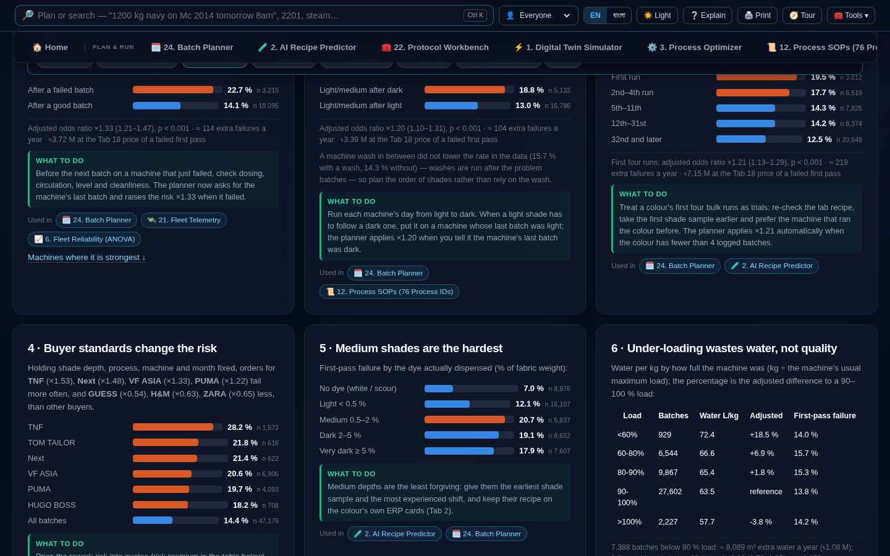

# Data Connections & Causal Inference Study
### Tab 25 Econometric Architecture · Multi-Table Joins · First-Pass Failure Drivers

> **Document Class:** Industrial Causal Analysis & Econometric Validation  
> **Platform Version:** Master™ v11 — AI Closed-Loop Dyeing Intelligence  
> **Associated Software Doc ID:** `SM-DASH-V11-SKM-2026`  
> **Associated Manual Doc ID:** `SM-MAN-V11-SKM-2026`  
> **Author & Lead Engineer:** SK. MAINUDDIN ([sk.mainuddin745@gmail.com](mailto:sk.mainuddin745@gmail.com))  
> **Integrity Verification:** SHA-256 Verified · PBKDF2-SHA256 (600,000 iter) Sealed  

---

## 1. Executive Summary

Most industrial analytics dashboards inspect tables in isolation: a batch table shows volumes, an alarm table shows faults, and an ERP card shows costs. **Tab 25 ("Connections Across the Data")** in Master™ v11 performs a multi-dimensional relational join across:
1. The chronological machine queue (`t_Batch`)
2. Colour recipe history (`Recipe` + `t_BatchPrepProducts`)
3. Customer/brand identification (`Customer`)
4. Actual chemical dispensing telemetry (`t_BatchPrepProducts`)
5. Master production reports and QA rework tracking

Using a sample of **47,179 verified dosed production batches** (August 2025 – September 2026), this study models the determinants of **first-pass failure** (defined as any batch requiring a chemical addition or triggering a full re-dye within 45 days). The baseline first-pass failure rate across this cohort is **14.41 %**.

To isolate true causal relationships from confounding variables, all effects are estimated via **multivariate logistic regression with two-way fixed effects** controlling simultaneously for:
- Process program ID ($\alpha_p$)
- Physical machine vessel ID ($\gamma_m$)
- Calendar month fixed effects ($\delta_t$)

$$\text{logit}(P(\text{Failure}_{i})) = \beta_0 + \mathbf{X}_i \boldsymbol{\beta} + \alpha_{p(i)} + \gamma_{m(i)} + \delta_{t(i)}$$

Every dollar and taka figure uses the Master™ v11 Registry standard: **৳32,629 ($265.00 USD at ৳123.13/USD)** per failed first pass, and **৳133.65/m³ ($1.085/m³)** for raw water and effluent treatment plant (ETP) combined.



---

## 2. Four Primary Empirical Drivers of First-Pass Failure

The multivariate fixed-effects model reveals four statistically robust drivers of failure across the fleet:

| Causal Factor | Empirical Observation in Data | Adjusted Odds Ratio (95 % CI) | Statistical Significance | Annualised Excess Failures | Prescriptive Shop-Floor Action |
|---|---|---|---|---|---|
| **1. Machine Failure Memory** | The batch immediately following a failed batch on the same vessel fails **22.7 %** of the time, compared to **14.1 %** following a successful batch (3,219 vs 19,095 batches). | **×1.33** (1.21 – 1.47) | $p < 0.001$ | **114 batches/yr** | Require physical inspection of dosing manifold, circulation pump, and cleanliness before loading next batch; flag status in planner. |
| **2. Light-After-Dark Sequencing** | Dyeing a light or medium shade immediately after a dark shade fails **18.8 %** vs **13.0 %** after light/white. For medium shades specifically, failure rises to **24.8 %** vs **18.7 %**. Intervening rinses did not eliminate this penalty in empirical logs. | **×1.20** (1.10 – 1.31) | $p < 0.001$ | **104 batches/yr** | Enforce strictly monotonic light-to-dark scheduling per vessel. Only route light shades to machines whose prior batch was light. |
| **3. New Colour Trial Penalty** | The 1st production run of a new colour fails **19.5 %**; the 2nd–4th runs fail **17.7 %**; the 32nd and subsequent runs fail only **12.5 %**. | **×1.21** (1.13 – 1.29) (first 4 runs) | $p < 0.001$ | **219 batches/yr** | Treat the first 4 bulk runs as pilot trials: mandatory lab confirmation, earlier shade sampling (at 60 min), and assignment to highest-stability vessels. |
| **4. Buyer Brand Specification** | Controlling for shade depth, fabric type, machine, and month, brand failure rates range from **8.5 % to 28.2 %** due to varying lab tolerances ($\Delta E$), approval standards, and metamerism indices. | See Brand Risk Taxonomy below | $p < 0.001$ | Across fleet | Price quality risk directly into commercial quotes; agree on illuminant D65/TL84 standards before bulk commitment. |

---

## 3. Brand Risk Taxonomy & Commercial Rework Valuation

Rework cost is calculated directly as:
$$\text{Annual Rework Cost} = \text{Failures per Year} \times \text{৳32,629}$$
$$\text{Risk Premium per Batch} = (\text{Buyer Failure Rate} - 14.41 \%) \times \text{৳32,629}$$

| Buyer Brand | Total Logged Batches | First-Pass Failure Rate | Adjusted Odds Ratio (95 % CI) | Annual Batches Extrapolated | Annual Rework Spend | Risk Premium per Batch |
|---|---|---|---|---|---|---|
| **The North Face (TNF)** | 1,573 | **28.2 %** | **×1.53** (1.29 – 1.81) | 406 failures | **৳13.25 M** ($107.6k) | **+৳4,487** |
| **TOM TAILOR** | 616 | **21.8 %** | ×0.98 (0.78 – 1.23) *n.s.* | 123 failures | **৳4.01 M** ($32.6k) | **+৳2,395** |
| **Next** | 622 | **21.4 %** | **×1.48** (1.18 – 1.87) | 122 failures | **৳3.98 M** ($32.3k) | **+৳2,274** |
| **VF ASIA** | 6,906 | **20.6 %** | **×1.33** (1.16 – 1.52) | 1,300 failures | **৳42.42 M** ($344.5k) | **+৳2,003** |
| **PUMA** | 4,093 | **19.7 %** | **×1.22** (1.06 – 1.39) | 738 failures | **৳24.08 M** ($195.6k) | **+৳1,723** |
| **HUGO BOSS** | 708 | **18.2 %** | ×1.27 (1.00 – 1.61) *n.s.* | 118 failures | **৳3.85 M** ($31.3k) | **+৳1,243** |
| **Other Brands** | 3,036 | **15.7 %** | 1.00 (Reference) | 437 failures | **৳14.26 M** ($115.8k) | **+৳424** |
| **BESTSELLER** | 1,905 | **13.5 %** | **×0.75** (0.63 – 0.89) | 236 failures | **৳7.70 M** ($62.5k) | **−৳284** |
| **GEORGE** | 3,901 | **13.1 %** | **×0.81** (0.70 – 0.93) | 469 failures | **৳15.30 M** ($124.3k) | **−৳421** |
| **RALPH LAUREN** | 1,531 | **12.9 %** | **×0.76** (0.62 – 0.92) | 180 failures | **৳5.87 M** ($47.7k) | **−৳502** |
| **G-STAR** | 792 | **12.2 %** | ×1.28 (0.99 – 1.65) *n.s.* | 89 failures | **৳2.90 M** ($23.6k) | **−৳705** |
| **C&A** | 8,163 | **11.2 %** | **×0.75** (0.66 – 0.85) | 835 failures | **৳27.25 M** ($221.3k) | **−৳1,057** |
| **GUESS** | 1,535 | **10.6 %** | **×0.54** (0.44 – 0.66) | 149 failures | **৳4.86 M** ($39.5k) | **−৳1,237** |
| **LF FASHION** | 607 | **10.1 %** | **×0.70** (0.52 – 0.95) | 56 failures | **৳1.83 M** ($14.9k) | **−৳1,423** |
| **H&M** | 10,340 | **9.5 %** | **×0.63** (0.56 – 0.71) | 898 failures | **৳29.30 M** ($238.0k) | **−৳1,609** |
| **ZARA** | 811 | **8.5 %** | **×0.65** (0.49 – 0.86) | 63 failures | **৳2.06 M** ($16.7k) | **−৳1,925** |

*Note: "n.s." indicates not statistically significant at 95 % confidence level.*

---

## 4. Operational Inefficiencies & Secondary Failure Drivers

### 4.1 Medium Shades Sensitivity
When categorising batches by actual mass of dispensed reactive dye:
- **No Dye (Optical White/Scour):** 7.0 % failure rate
- **Light Shades (< 0.5 % owf):** 12.1 % failure rate
- **Medium Shades (0.5 – 2.0 % owf):** **20.7 % failure rate** (Peak failure region)
- **Dark Shades (2.0 – 4.0 % owf):** 19.1 % failure rate
- **Very Dark / Black (> 4.0 % owf):** 17.9 % failure rate

*Physical explanation:* Medium shades exist on the steepest section of the exhaustion/fixation curve. Small variances in liquor ratio, salt dosing, or temperature produce large visual $\Delta E$ deviations compared to dark shades where fiber saturation cushions slight dosing fluctuations.

### 4.2 Vessel Under-Loading Penalty
Vessel loading below rated capacity does not harm colour quality, but causes severe resource inflation:
- Loading $< 60 \%$ of maximum rated capacity: **+18.5 % water per kg** (adjusted for liquor ratio).
- Loading $60 – 80 \%$ of capacity: **+6.9 % water per kg**.
- Quality odds ratio: $\times 0.86$ ($95 \% \text{ CI } 0.70 – 1.05$, not statistically different from 1.0).
- Fleet impact: **8,089 m³ of water** wasted annually from under-loading vessels.

### 4.3 Operator Interventions as In-Process Alarms
Manual parameter overrides during batch execution act as leading indicators of process instability:
- Zero manual overrides: **11.0 %** failure rate.
- $> 10$ manual parameter changes: **25.7 %** failure rate.
- Automated operator calls triggered: **19.4 %** failure rate vs **11.0 %** when uninterrupted.

---

## 5. Non-Drivers: Variables Proven Uncorrelated with Failure

A vital contribution of rigorous econometric analysis is disproving common shop-floor folklore. The following variables were tested and confirmed to have **no statistically significant causal impact** on first-pass failure:

1. **Shift Schedule:**
   - Shift A (06:00 – 14:00): 14.8 %
   - Shift B (14:00 – 22:00): 14.3 %
   - Shift C (22:00 – 06:00): 14.1 %
   - *Verdict:* The hypothesis that night shift fatigue elevates failure is disproven ($p > 0.40$).
2. **Day of Week:** Failure rate fluctuates randomly between 13.9 % and 14.8 % across all seven days ($p = 0.82$).
3. **Lab-to-Bulk Flag:** Batches marked as initial lab-to-bulk scale-ups failed at 16.1 % vs 17.7 % for standard bulk ($\text{OR } = 0.92$, $95 \% \text{ CI } 0.70 – 1.22$, $p = 0.570$).
4. **Machine Idle Time Prior to Batch:** Batches starting after $> 12$ hours of vessel inactivity failed at 12.8 % vs 14.4 % normally ($\text{OR } = 0.89$, $95 \% \text{ CI } 0.57 – 1.39$, $p = 0.610$). Cold machines do not increase failure when pre-warmed fill water is used.
5. **Loading-to-Start Queue Delay:** Batches starting $< 10$ minutes after loading failed at 15.5 %; batches waiting 4–24 hours in the kier failed at 12.8 % ($p = 0.28$).

---

## 6. Integration into the Tab 24 Batch Planner

In Master™ v11, the causal connection insights are integrated directly into the pre-flight risk calculation of Tab 24:

```
Baseline In-Process Risk Model (AUC 0.653 · Average Precision 0.334)
   │
   ├── Multiplied by Buyer Odds Ratio (e.g. ×1.53 for TNF, ×0.63 for H&M)
   ├── Multiplied by Colour History Multiplier (×1.21 if colour runs < 4)
   ├── Multiplied by Prior Batch Outcome (×1.33 if machine failed previous batch)
   └── Multiplied by Sequencing Penalty (×1.20 if light/medium follows dark)
   │
   ▼
Updated Pre-Flight Risk Score: AUC 0.677 · Average Precision 0.406 (+21.5% AP Lift)
```

At the shop floor, the planner displays structured warning chips identifying each active risk driver (e.g., `TNF buyer: +৳4,487 risk premium`, `Prior batch failed on Mc 2014: inspect circulation`, `Light after dark: confirm wash sequence`).

---
*© 2026 SK. MAINUDDIN. All Rights Reserved. Master™ Closed-Loop Dyeing Intelligence.*
