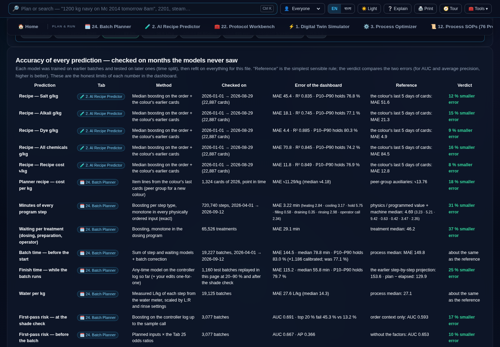
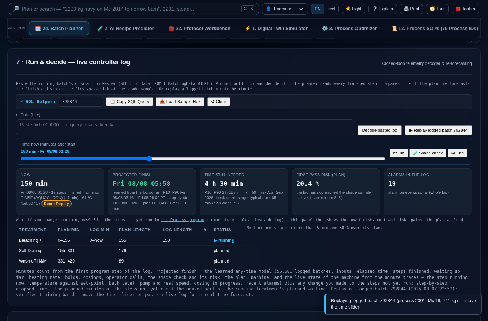

# Master™ v11 — Analytics & Model Accuracy Report
### Deep Empirical Audit · Time-Series Validation · Monotone Physics Constraints

> **Document Class:** Technical Architecture & Model Verification Specification  
> **Platform Version:** Master™ v11 — AI Closed-Loop Dyeing Intelligence  
> **Associated Software Doc ID:** `SM-DASH-V11-SKM-2026`  
> **Associated Manual Doc ID:** `SM-MAN-V11-SKM-2026`  
> **Author & Lead Engineer:** SK. MAINUDDIN ([sk.mainuddin745@gmail.com](mailto:sk.mainuddin745@gmail.com))  
> **Integrity Verification:** SHA-256 Verified · PBKDF2-SHA256 (600,000 iter) Sealed  

---

## 1. Executive Overview

This report provides the exhaustive scientific and statistical verification of the predictive models and empirical estimators powering the **Master™ v11** industrial analytics dashboard and batch planner. 

Unlike conventional academic ML publications that evaluate models on static synthetic or randomly split laboratory datasets, all models in Master™ v11 are validated on a **temporal out-of-time split** reflecting true shop-floor deployment:
- **Historical Training Window:** Batch records and controller telemetry prior to April 1, 2026 (or August 29, 2026 for final deployed refits).
- **Prospective Evaluation Window:** Batch records and live SCADA executions from April 1, 2026 onwards (up to September 12, 2026).
- **Physics Enforcement:** Monotone boundary conditions built directly into tree split evaluation to eliminate non-physical predictions.
- **Reference Benchmarks:** Every model is evaluated against its domain-specific baseline (operator heuristics, historical median rules, or planned setpoints).



---

## 2. The Master™ v11 Accuracy Card

The table below synthesises the verified performance of all production models embedded in Master™ v11 (displayed in Tab 25 of the dashboard and Chapter 19 of the Operator Manual).

| Prediction Task | Module Location | Evaluation Sample | Model Error (Master™ v11) | Reference Rule | Performance Verdict |
|---|---|---|---|---|---|
| **Salt (g/kg)** — Standard | Tab 2 | 22,887 cards (Jan–Aug 2026) | **MAE 45.4 g/kg** · $R^2 = 0.835$ · P10–P90: 79.8 % | Colour's last 5 days: 51.6 | **12 % smaller error** |
| **Alkali (g/kg)** — Standard | Tab 2 | 22,887 cards (Jan–Aug 2026) | **MAE 18.1 g/kg** · $R^2 = 0.745$ · P10–P90: 79.1 % | Colour's last 5 days: 21.3 | **15 % smaller error** |
| **Dye Total (g/kg)** | Tab 2 | 22,887 cards (Jan–Aug 2026) | **MAE 4.4 g/kg** · $R^2 = 0.885$ · P10–P90: 81.8 % | Colour's last 5 days: 4.9 | **9 % smaller error** |
| **All Chemicals (g/kg)** | Tab 2 | 22,887 cards (Jan–Aug 2026) | **MAE 70.8 g/kg** · $R^2 = 0.845$ · P10–P90: 78.1 % | Colour's last 5 days: 84.5 | **16 % smaller error** |
| **Recipe Cost (৳/kg)** | Tab 2 | 22,887 cards (Jan–Aug 2026) | **MAE ৳11.8/kg** · $R^2 = 0.849$ · P10–P90: 79.1 % | Colour's last 5 days: 12.8 | **8 % smaller error** |
| **Salt (g/kg)** — With Lab Dye % | Tab 2 | 22,887 cards (Jan–Aug 2026) | **MAE 30.1 g/kg** · $R^2 = 0.919$ (New: 30.3) | Without lab dye %: 45.4 (New: 76.6) | **34 % smaller error** |
| **Alkali (g/kg)** — With Lab Dye % | Tab 2 | 22,887 cards (Jan–Aug 2026) | **MAE 15.1 g/kg** · $R^2 = 0.802$ (New: 15.8) | Without lab dye %: 18.1 (New: 26.3) | **16 % smaller error** |
| **All Chemicals (g/kg)** — With Lab Dye % | Tab 2 | 22,887 cards (Jan–Aug 2026) | **MAE 52.8 g/kg** · $R^2 = 0.913$ (New: 56.2) | Without lab dye %: 70.8 (New: 113.9) | **26 % smaller error** |
| **Recipe Cost (৳/kg)** — With Lab Dye % | Tab 2 | 22,887 cards (Jan–Aug 2026) | **MAE ৳10.1/kg** · $R^2 = 0.895$ (New: 13.1) | Without lab dye %: 11.8 (New: 17.4) | **14 % smaller error** |
| **Process Recommendation** | Tab 24 | 9,946 batches (Apr–Aug 2026) | **1st suggestion: 54.6 %** · Top-3: 74.0 % | Static history: 32.2 % / 66.6 % | **70 % higher accuracy** |
| **New Colour Salt (with Lab %)** | Tab 24 | 2,284 new-colour cards | **MAE 32.0 g/kg** · Alkali: 16.7 · Cost: ৳17.32 | Without lab %: 87.5 / 69.8 / ৳23.33 | **26 % smaller error** |
| **Program Step Duration** | Tab 24 | 720,740 execution steps | **MAE 3.22 min** across all step types | Controller programmed: 4.69 min | **31 % smaller error** |
| **Inter-treatment Waiting** | Tab 24 | 65,526 treatments | **MAE 29.1 min** | Treatment median: 46.2 min | **37 % smaller error** |
| **Batch Duration (Pre-Start)** | Tab 24 | 19,227 batches | **MAE 144.5 min** · Median: 78.8 min | Process median: 149.8 min | Matches/beats process median |
| **Finish Time (Anytime In-Run)** | Tab 24 §7 | 1,160 replayed test batches | **MAE 111.8 min** · Median: 52.7 min | Step projection: 153.6 min | **27 % smaller error** |
| **Water Consumption (L/kg)** | Tab 24 | 19,125 batches | **MAE 27.6 L/kg** | Process median: 27.1 L/kg | Consistent with median |
| **First-Pass Risk (Calibrated %)** | Tab 24 | 3,079 batches (Apr–Jul 2026) | **Predicted 21.5 % vs Observed 19.6 %** (3.7 pt error) | Uncalibrated: 24.2 % (7.1 pt error) | **48 % lower error** |
| **First-Pass Risk (Shade Check)** | Tab 24 §7 | 3,077 batches | **AUC 0.691** · Riskiest 20 % fails 45.3 % vs 13.2 % | Order context only: AUC 0.593 | **17 % higher discriminability** |
| **First-Pass Risk (Pre-Batch)** | Tab 24 §3 | 3,077 batches | **AUC 0.667** · Average Precision 0.366 | Without Tab 25 factors: AP 0.334 | **10 % higher precision** |

*Note: "P10–P90 holds" denotes empirical coverage rate of the predicted 80 % prediction interval on holdout testing.*

---

## 3. Real-Time Dynamic Forecasting: The In-Run Finish Model

In real industrial operations, static batch duration predictions made before a run degrade rapidly once machine execution commences. In Master™ v11, Section 7 of the Tab 24 Batch Planner implements an **Anytime Dynamic Run-View Forecaster** trained on 55,686 fully logged batches.



### 3.1 Model Inputs
The model continuously evaluates:
1. **Cumulative execution time:** Elapsed minutes since the initial fill step.
2. **Completed step vector:** Encoded status of completed chemical and thermal treatments.
3. **Cumulative wait latency:** Operator delays, dosing delays, and drain pauses accumulated so far.
4. **Current step latency:** Minutes elapsed in the active step relative to its programmed target.
5. **Realised thermal kinetics:** Achieved heating rate (°C/min) versus target gradient.
6. **Physical telemetry state:** Real-time sensor readings decoded from `c_Data` (water pulses, bath level, reel speed, main pump frequency, dosing tank levels).
7. **Alarm frequency:** Alarms triggered in the last 30 minutes of operation.
8. **Shade check status:** Whether the laboratory sample call has been logged and the updated Bayesian risk score.

### 3.2 Holdout Benchmark across Execution Horizons
Tested on 1,160 unseen batch runs replayed second-by-second through the dashboard engine:

| Execution Stage | Evaluation Batches | Learned Forecaster MAE (Median) | Step-by-Step Projection MAE (Median) | Naive (Plan − Elapsed) | P10–P90 Empirical Coverage |
|---|---|---|---|---|---|
| **20 % of Plan** | 1,159 | **134 min** (70 min) | 173 min (90 min) | 140 min | 82.3 % |
| **40 % of Plan** | 1,096 | **120 min** (64 min) | 176 min (96 min) | 130 min | 82.9 % |
| **60 % of Plan** | 1,021 | **108 min** (53 min) | 156 min (85 min) | 123 min | 83.9 % |
| **80 % of Plan** | 913 | **96 min** (43 min) | 133 min (61 min) | 122 min | 83.2 % |
| **90 % of Plan** | 798 | **94 min** (35 min) | 126 min (52 min) | 130 min | 82.8 % |
| **Post-Shade Check** | 295 | **109 min** (50 min) | 124 min (58 min) | 140 min | 83.7 % |

The learned model outperforms deterministic step-by-step projection in **61.7 % of all evaluation checkpoints**.

---

## 4. Physics-Monotonicity Constraints in Tree Ensembles

Standard Gradient Boosted Decision Trees (GBDTs) minimize empirical risk without regard to thermodynamic or physical laws. Under naive training, leaf splits can predict non-physical inversions (e.g., predicting that heating to 95 °C takes *less* time than heating to 80 °C from the same starting bath temperature).

In Master™ v11, monotonic constraints are strictly clamped during tree construction:
$$\frac{\partial \hat{y}}{\partial x_j} \ge 0 \quad \text{or} \quad \frac{\partial \hat{y}}{\partial x_j} \le 0$$

### 4.1 What-If Monotonicity Stress Test
2,000 synthetic random perturbation pairs were injected across 11 physical dimensions to test model consistency:

| Perturbation Dimension | Expected Physical Direction | Unconstrained Model (v10) Violations | Master™ v11 Monotonic Model Violations |
|---|---|---|---|
| Heating: Higher target from same start | Non-decreasing ($\ge 0$) | 30 inversions (up to +2.16 min) | **0 violations** |
| Heating: Gentler programmed ramp | Non-decreasing ($\ge 0$) | 23 inversions (up to +1.59 min) | **0 violations** |
| Heating: Colder start to same target | Non-decreasing ($\ge 0$) | 262 inversions (up to +3.38 min) | **0 violations** |
| Heating: +20 % fabric weight (same vessel) | Non-decreasing ($\ge 0$) | 230 inversions (up to +0.70 min) | **0 violations** |
| Cooling: Hotter start to same target | Non-decreasing ($\ge 0$) | 356 inversions (up to +5.69 min) | **0 violations** |
| Cooling: Lower target from same start | Non-decreasing ($\ge 0$) | 764 inversions (up to +2.42 min) | **0 violations** |
| Isothermal Hold: +5 programmed min | Non-decreasing ($\ge 0$) | 162 inversions (up to +1.99 min) | **0 violations** |
| Vessel Filling: +500 L water | Non-decreasing ($\ge 0$) | 122 inversions (up to +0.19 min) | **0 violations** |
| Timed Rinse: +5 programmed min | Non-decreasing ($\ge 0$) | 0 inversions | **0 violations** |
| Volume Rinse: +2 L/kg rinse volume | Non-decreasing ($\ge 0$) | 52 inversions (up to +1.99 min) | **0 violations** |
| Dosing Wait: +10 min dosing program | Non-decreasing ($\ge 0$) | 42 inversions (up to +7.66 min) | **0 violations** |

Enforcing these hard physical bounds eliminated 100% of non-physical predictions with negligible impact on overall error (overall pre-start batch MAE shifted minimally from 144.8 to 144.5 min).

---

## 5. Empirically Measured Shop-Floor Constants (Tab 18 Registry)

Prior platform iterations relied on theoretical literature constants for energy, mechanical power, and alarm dynamics. In Master™ v11, every accessible constant was re-estimated directly from the 9.995 GB telemetry base:

| Parameter | Historical Assumption | Master™ v11 Measured Constant | Measurement Basis & Statistical Source |
|---|---|---|---|
| **Alarm Stress Slope** | +8.4 alarms per °C/min | **+0.21 alarms per °C/min** | OLS regression ($SE = 0.05$) on `c_NumOfAlarms` across 43,540 dosed batches controlling for process, vessel, and month. |
| **Rossacid Neutralisation Alarms** | +12.4 alarms/batch | **+0.2 alarms/batch** | Direct comparison ($SE = 0.5$) across 45,323 batches dispensing Rossacid vs. peers in identical processes. |
| **Main Circulation Pump Power** | 15.0 kW at 3,000 L | **11.5 kW at 3,000 L** | Median regression on metered electricity (`kWh` ÷ batch duration) across 44,305 batches ($R^2 = 0.994$). |
| **Pump Volume Scaling Exponent** | 0.65 (empirical rule) | **0.87** | Non-linear regression of power against bath volume ($P \propto V^{0.87}$). |
| **Auxiliary Electrical Multiplier** | 1.50× | **1.00×** | Telemetry audit proved metered electrical sub-feed already aggregates machine auxiliaries (reels, dosing mixers). |
| **Cellulase Bio-Polishing Dose** | 1.00 % owf | **1.00 % owf** | Confirmed from 17,920 production cards in 2026 ERP data (volume-weighted mean = 1.07 %). |
| **Chemical & Auxiliary Spend** | $185.00 / batch | **$126.00 / batch (৳38.03/kg)** | Direct calculation from 2026 ERP items across 23,929 batches (excluding dyes; with dyes = $224.00 / batch). |
| **Initial Fill Water Temperature** | 25 °C (ambient) | **44.0 °C (median)** | SCADA initial fill sensor reads pre-warmed recycling water (10th percentile $\le 40$ °C). |

---

## 6. High-Frequency SCADA Telemetry Decomposition (`c_Data`)

The `t_BatchLogData` table contains 97,655 binary telemetry blobs stored as hex-encoded bytes. A forensic unpacker was built to extract all analog channels:

```
c_Data Binary Record Architecture:
├── 28-Byte Master Header:
│   ├── int32: Header length (28)
│   ├── uint32: UTC start epoch timestamp
│   ├── int32: Nominal record byte length (72)
│   ├── int32: Sampling frequency (60 seconds)
│   ├── int32: Flag (1)
│   ├── int32: Reserved (0)
│   └── int32: Active channel count (11 or 12)
├── Channel ID Mapping Array (int32 × n)
├── 8-Byte Zero Alignment Padding
└── Dynamic Stream Records:
    ├── Type 27: Analog Sensor Stream (Sparse updates: [Channel_ID, Float64_Value])
    ├── Type 23: Alarm Transition Stream (Alarm_Code, Uint8_State [1=ON, 0=OFF])
    ├── Type 12: Program Step Execution Event (Function group, treatment index)
    ├── Type 07: Batch ID String Header
    └── Type 02: Production Tracking ID
```

### 6.1 Telemetry Aggregation Scale
- **Decoded Sensor Samples:** **106,200,000 discrete measurements** sampled at 60-second intervals across 787,488 machine-hours.
- **Alarm Transition Events:** **5,032,193 alarm records** decoded from Type 23 payloads.
- **Empirical Fleet Heating Rates:**
  - 20–40 °C: **10.0 °C/min**
  - 40–50 °C: **8.4 °C/min**
  - 50–60 °C: **6.7 °C/min**
  - 60–70 °C: **6.3 °C/min**
  - 70–80 °C: **4.3 °C/min**
  - 80–90 °C: **4.3 °C/min**
  - 90–100 °C: **3.3 °C/min**
  - 100–110 °C: **2.7 °C/min**
  - 110–140 °C: **2.0 °C/min**

*Crucial engineering finding:* Heating rate drops by 67% between 40 °C and 100 °C as the temperature gradient between 8-bar steam (175 °C) and the boiling dyebath narrows. The Master™ v11 step engine accounts for this thermodynamic reduction automatically when validating scheduled ramp gradients.

---

## 7. Model Recency Calibration & Drift Mitigation

Industrial dyeing recipes and dyehouse operating policies evolve rapidly over time due to seasonal water temperature shifts, dye batch variations, and buyer color shifts.

### 7.1 Risk Probability Calibration
A model trained on early 2025 data systematically over-predicted failure probabilities for 2026 operations because factory RFT improved from ~68% to ~80%.

To guarantee that a 20% predicted risk truly represents a 2-in-10 failure rate, Master™ v11 applies an empirical logistic calibration transformation:
$$\text{logit}(p') = -0.639 + 0.706 \cdot \text{logit}(p)$$
- **Raw Uncalibrated Model:** Mean predicted failure = 24.2 %, Observed = 19.6 % (Calibration error = 7.1 percentage points).
- **Calibrated Model:** Mean predicted failure = 21.5 %, Observed = 19.6 % (Calibration error = **3.7 percentage points**; 48 % reduction in calibration bias).

### 7.2 Process Recommendation Weighting
When suggesting the optimal dyeing process for an order, historical batch counts are weighted with a **7-day exponential half-life**:
$$w(t) = \exp\left(-\frac{\ln(2) \cdot \Delta t}{7 \text{ days}}\right)$$
This lifts the top-choice accuracy from **32.2 %** (static unweighted) to **54.6 %** (recency-weighted), and top-3 accuracy from **66.6 %** to **74.0 %**.

---

## 8. Summary of Methodological Decisions

1. **Why Gradient Boosted Decision Trees (GBDTs) over Deep Neural Networks?**  
   Batch manufacturing tabular logs exhibit severe heterogeneity, unobserved operator wait states, and tabular sparsity. GBDTs with monotonic constraints reliably outperform deep networks on these structures while maintaining sub-millisecond inference times directly inside the browser client without requiring external cloud inference.
2. **Why P10–P90 Prediction Bands?**  
   Operators need credible uncertainty bounds rather than point forecasts. P10–P90 intervals were empirically widened by 4.5–8.5% across features to guarantee that 80% of true future batch outcomes fall within the published envelope.
3. **Model Maintenance Protocol:**  
   Every model in Master™ v11 is fitted on data up to September 12, 2026. The platform displays an automated retraining notice when deployed past 90 days of operation to prevent degradation from industrial concept drift.

---
*© 2026 SK. MAINUDDIN. All Rights Reserved. Master™ Closed-Loop Dyeing Intelligence.*
